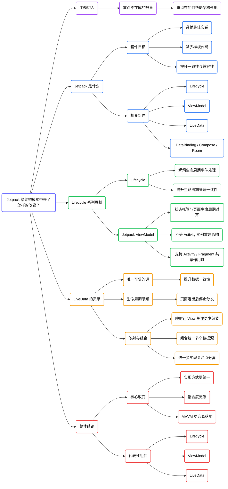
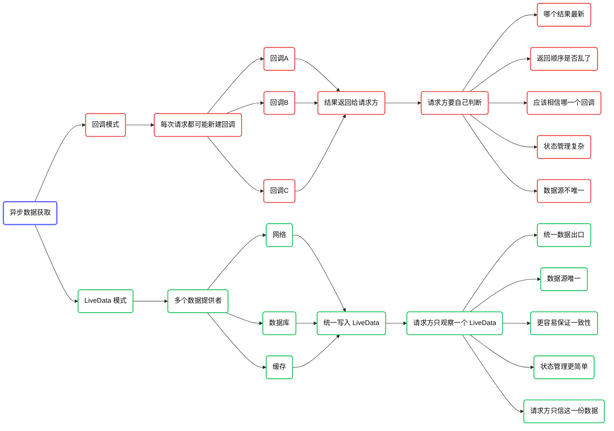

# Jetpack 给架构模式带来了怎样的改变？

Jetpack 和 MVVM 之间的关系，是 Android 架构演进里绕不开的一部分。

MVVM 可以说是官方通过 Jetpack 带动起来的新风向。这里真正要讨论的，其实并不只是“Jetpack 是什么”，而是：Jetpack 到底给 Android 架构模式的落地，尤其是 MVVM 的落地，带来了哪些具体改变？

## 先明确重点：不在“Jetpack 有多少库”

这里有两个关键词：Jetpack 和架构模式。

如果只是从字面上理解，我们当然可以介绍 Jetpack 是什么、有哪些组件，但那还不够。更重要的是从实践角度出发，去看 Jetpack 如何帮助 MVVM 在一致性、低耦合和工程效率上真正落地。

## Jetpack 是什么？

Jetpack 本质上是由多个库组成的一套开发套件，它的目标是：

- 帮助开发者遵循最佳实践；
- 减少样板代码；
- 编写能在更多 Android 版本和设备上稳定运行的代码。

从这个定义就能看出来，Jetpack 本身就在帮助我们提升一致性、研发效率和兼容性。

Jetpack 发展到现在已经包含很多库，其中与 MVVM 关系最紧密的，主要集中在 Lifecycle 包及其周边能力上。

## 与 MVVM 关系最紧密的 Jetpack 组件有哪些？

最关键的一组，是 Lifecycle 相关组件：

- Lifecycle
- Jetpack ViewModel
- Jetpack LiveData

除此之外，还有一些与 MVVM 落地关系密切的组件或方案：

- DataBinding：帮助实现 View 与 ViewModel 的数据绑定；
- Compose：提供新的 View 层实现方式；
- Paging：提供分页场景的标准化方案；
- Room：提供数据库 ORM 支持；
- WorkManager：提供后台任务调度支持。

其中，真正从架构层面带来直接改变的核心，主要还是 Lifecycle、ViewModel 和 LiveData。

## Lifecycle：它解决了什么问题？

在很多 Android 工程里，我们经常会把 Activity 当作生命周期事件的唯一来源，这会带来两个问题：

第一，其他类如果想感知生命周期，往往需要直接拿到 Activity 实例。  
这样做不仅会增加维护成本，还容易带来内存泄漏风险。

第二，在像 MVP 这种模式中，很多业务逻辑明明在 Presenter 里，但生命周期事件却在 Activity 里产生，于是就会出现一种非常别扭的情况：Activity 需要把生命周期事件一层层透传给 Presenter。

这种方式虽然能工作，但会让 Activity 中出现大量不必要的依赖和代码，导致生命周期方法越来越臃肿。

Lifecycle 的出现，就是为了把“生命周期感知”这件事从 Activity 中解耦出来。

通过 LifecycleObserver 等机制，外部类可以直接监听和响应生命周期变化。这样一来：

- Activity 不再需要自己处理那么多生命周期相关业务逻辑；
- 生命周期事件的处理代码，可以直接放到真正关心这些事件的类里；
- 生命周期管理方式也因此变得更统一。

所以，Lifecycle 对架构的贡献，可以概括为：通过统一的观察机制，解决生命周期管理一致性问题。

## Jetpack ViewModel：它带来了什么变化？

在前面的章节里，我们提到过一个问题：Activity 的生命周期和 Activity 实例本身并不总是严格一致。比如横竖屏切换时，旧 Activity 实例可能被销毁，而新的实例会重新创建。

如果 ViewModel 只是普通成员变量，那么它也会随着 Activity 实例一起消失，页面状态和数据自然就无法稳定延续。

Jetpack ViewModel 的意义，就在于：

- 它能够让 ViewModel 的生命周期和页面生命周期对齐；
- 它不受 Activity 实例销毁和重建的直接影响；
- 它可以稳定托管页面的数据和状态。

除此之外，Jetpack ViewModel 还解决了另一个很重要的问题：作用域共享。

在很多场景里，我们希望 Activity 和它内部的多个 Fragment 共享同一份页面状态。如果没有 Jetpack ViewModel，这件事通常会写得比较别扭，例如通过强转 Activity、手动传递对象等方式实现。

而有了 Jetpack ViewModel 之后，只要传入合适的 `LifecycleOwner`，就可以灵活决定：

- 获取 Activity 级别共享的 ViewModel；
- 或者获取 Fragment 自己独立的 ViewModel。

因此，Jetpack ViewModel 对架构的贡献主要体现在两个方面：

- 让页面状态托管与页面生命周期对齐；
- 让 Activity 和 Fragment 能够共享作用域。

## LiveData：它为什么重要？

LiveData 是一个可观察、具备生命周期感知能力的数据持有者。

它最重要的理念，是把数据流转建立在“唯一可信的源”之上。

## 什么叫“唯一可信的源”？

如果用传统回调的方式来获取异步数据，请求方通常会不断创建新的回调对象。这样做虽然方便，但会带来一个问题：当请求方有多个回调同时存在时，它就必须自己判断，到底该相信哪个回调返回的数据。

这会增加数据使用方的复杂度，也会让数据一致性变差。

而 LiveData 的思路不同。无论数据由谁写入，数据使用方关注的始终只有这一个 LiveData 实例。这样一来：

- 数据请求方只关心一个统一入口；
- 数据写入顺序和来源细节，由数据提供方内部处理；
- 数据一致性因此更容易得到保证。

这就是 LiveData 对架构的第一层贡献：提高数据一致性。

## LiveData 为什么还有助于关注点分离？

LiveData 不只是一个“能观察数据变化”的容器，它还支持映射和组合。

### 映射：让 View 关注更少的细节

比如，模型层提供的是一个 `Product`，其中包含很多字段，而 View 层真正关心的可能只是“商品价格是否低于 100 元，从而要不要显示促销标签”。

如果 View 直接去解析 `Product`，那说明 View 层仍然关注了 Model 层的细节，关注点并没有真正分离。

更合理的做法，是在 ViewModel 中通过 `Transformations.map` 把原始的 `LiveData<Product>` 映射成一个更聚焦的 `LiveData<Boolean>`，让 View 直接绑定“是否显示促销标签”这个状态。

这样一来，View 层就只关心自己真正要展示的内容。

### 组合：把多个数据源整理成一个数据源

通过 `MediatorLiveData`，我们还可以把多个 LiveData 组合成一个新的 LiveData。这样做有两个重要意义：

- 把多个数据源收束成一个统一的数据入口，让 View 层关注更少细节；
- 当数据提供方无法保证 LiveData 实例唯一时，可以在 ViewModel 层重新做统一包装，避免 View 层频繁切换观察对象。

所以，LiveData 的第二层贡献，是帮助 ViewModel 更好地实现关注点分离。

## DataBinding、Compose、Room 这些组件又带来了什么？

除了 Lifecycle、ViewModel 和 LiveData，Jetpack 中还有一些组件也在从不同层面改善架构实践。

- DataBinding：减少 View 与 ViewModel 之间的样板绑定代码。
- Compose：通过声明式 UI 和函数组合，让 View 层实现方式更灵活，也降低了部分绑定代码复杂度。
- Room：通过 ORM 方式统一数据库访问，提高数据层的一致性。
- WorkManager：为后台任务调度提供更规范的落地方式。

从架构角度看，这些组件并不是在改变架构思想本身，而是在帮助架构实践更容易落地。

## 总结

Jetpack 对架构模式带来的改变，不是简单地“多了一批库”，而是通过一整套官方工具，把很多过去容易写乱、写重、写耦合的地方，逐步变成了更统一、更低耦合的实现方式。

如果把重点收束起来，Jetpack 对 MVVM 落地最重要的贡献主要有三点：

- Lifecycle：解决生命周期管理一致性。
- Jetpack ViewModel：让状态托管与页面生命周期对齐，并支持作用域共享。
- LiveData：通过唯一可信的源、生命周期感知、映射和组合能力，提升数据一致性与关注点分离。

也正因为如此，Jetpack 才真正推动了 MVVM 在 Android 平台上的普及。

关于 Jetpack 对架构实践的影响，先梳理到这里。后文继续介绍更多相关组件。

## 横向脑图

## “回调模式 vs LiveData 模式”的对比图

