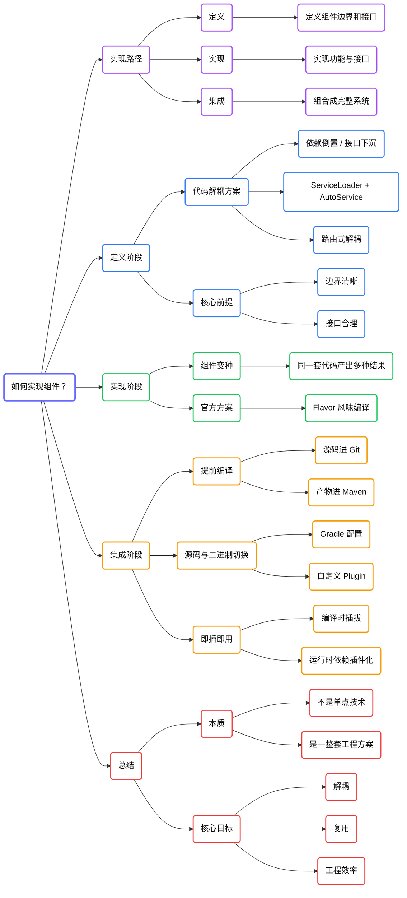

# 如何实现组件？

理解了组件化的定义，以及它要解决的复用与隔离问题之后，接下来更关键的问题就是：组件化究竟该怎么实现？

## 先看实现路径：定义、实现、集成

如果把组件化的落地过程抽象一下，一般可以拆成三步：

- 定义：定义组件边界，也就是定义组件接口。
- 实现：实现组件功能，以及实现组件对外提供的接口。
- 集成：把多个组件组合成一个完整系统或 App。

对应到技术问题上：

- 在定义阶段，要解决如何解除代码耦合。
- 在实现阶段，要解决如何支持组件变种。
- 在集成阶段，要解决如何提前编译，以及如何做到组件的即插即用。

## 定义组件边界：先解决代码解耦

在组件化实践中，代码解耦通常是“原理上最简单、落地时最困难”的部分。因为真实项目中的耦合方式多种多样，没有一种技术方案能一劳永逸地解决所有问题。

真正的前提，是先把组件边界划清楚，再定义出合理的组件接口。只有边界清晰了，后面的解耦方案才有意义。

## 组件之间如何解耦？

### 方案一：依赖倒置，也就是接口下沉

这是最经典的一种方式。

假设账号组件需要向首页组件提供登录能力和获取用户 ID 的能力，那么我们可以先在更底层定义一组接口，让两个组件都只依赖这组抽象接口，而不直接依赖对方的具体代码。

接着，由账号组件去实现这些接口；再由更高层的装配逻辑去创建实例，并把它交给首页组件使用。这样就可以做到：

- 组件之间没有直接代码依赖；
- 组件之间仍然可以相互提供能力。

这种方式的好处是实现成本低、原理清晰，缺点则是接口维护量可能比较大。这个问题通常可以借助注解处理器和代码自动生成来缓解。

### 方案二：ServiceLoader

第二种方式是使用 Java 提供的 `ServiceLoader`。

从本质上看，它仍然属于依赖倒置，因为我们依然需要定义接口和实现类。不同的是，有了 `ServiceLoader` 之后，就不一定要手动注入实例了。调用方可以通过 `ServiceLoader.load()` 根据接口类型加载实现实例。

它的实现原理并不神秘：在 `META-INF/services` 目录下，会有一个以接口全名命名的配置文件，里面列出所有实现类。运行时，`ServiceLoader` 会读取这个文件并创建对应实现。

如果觉得手动维护这类配置文件过于麻烦，也可以结合 Google 的 AutoService，在编译期通过注解处理器自动生成。

### 方案三：路由式解耦

第三种常见方式，是路由式解耦。

如果我们实现了一套路由机制，能够根据 URI 去启动某个 Activity、Service 或其他组件，那么就可以把组件能力包装成四大组件，再通过 URI 调用。路由表负责维护 URI 和具体组件之间的映射关系。

这种方式的优势在于灵活性很高，缺点是约束性相对弱。例如 URI 写错时，问题不一定能在编译阶段暴露出来。

阿里 ARouter、滴滴 DRouter 等开源框架，本质上都属于这一路线。

## 总结一下：什么样的技术都能用于组件解耦？

只要一种技术方案能够满足下面这个要求，它就可以用于组件化解耦：

在两个组件之间不发生直接代码接触的前提下，仍然能让它们相互提供能力。

## 实现阶段：如何支持组件变种？

还是以账号组件为例。

如果同一个账号组件要同时服务于国内版和海外版 App，而不同版本、不同商店、不同地区又要求登录方式、主题色、资源文件甚至依赖 SDK 不同，那么这就不是简单的“代码复用”问题，而是“同一套主体功能，如何编译出多个差异化产物”的问题。

这类情况，就叫组件变种。

在 Android 平台上，最可靠、也最官方推荐的实现方式，就是 Flavor，也就是风味编译。通过 Flavor，可以对代码、资源乃至依赖的 SDK 做差异化编译，让同一套组件代码生成多个不同产物。

## 集成阶段：如何实现提前编译？

组件化的一个重要收益，是可以让大量稳定组件提前编译成二进制产物，只保留少量正在开发或频繁变动的组件以源码形式参与工程。

这样做有两个直接好处：

- 提升编译速度；
- 降低开发者接触代码的范围，从而提升代码安全性和管理效率。

要实现这一点，通常需要两类仓库协同工作：

- Git 仓库：存放源码工程；
- Maven 仓库：存放编译后的 AAR 等二进制产物。

组件开发完成并稳定后，可以通过发布任务把它编译并上传到 Maven 仓库；而在本地工程装配时，则可以根据配置决定某个组件使用源码还是二进制。

## 源码与二进制形态如何灵活切换？

当我们需要开发某个组件时，希望它以源码工程的形式接入；当我们只是依赖它时，又希望它以 AAR 的方式参与编译。

最原始的方式，就是手动修改 Gradle 依赖脚本。但当组件数量很多时，这种方式效率很低。

更常见的做法，是通过自定义 Gradle Plugin，把这些依赖切换逻辑、源码仓库拉取逻辑、发布逻辑封装起来。这样一来，组件从源码切到二进制、从二进制切到源码，就能通过更简单的配置完成。

## 仓库管理还需要解决什么问题？

除了依赖切换之外，组件化落地通常还需要解决这些问题：

- 如何把远程源码仓库自动组合进本地主工程；
- 如何管理多个 Git 仓库；
- 如何把本地修改再推回对应源码仓库；
- 如何把组件统一编译并发布到 Maven；
- 如何让这些操作尽可能自动化。

这些问题通常会通过自研 Gradle 插件、IDE 工具支持，或者公司内部已有的多仓管理工具来解决。

## 最后一步：如何做到组件即插即用？

如果前面这些条件都已经具备：

- 组件之间没有强耦合；
- 组件可以支持差异化编译；
- 源码与二进制可以灵活切换；
- 仓库管理和发布机制已经打通；

那么编译时的即插即用基本就是顺理成章的结果。

至于运行时的即插即用，则通常要借助插件化框架来完成。从严格意义上说，插件化更像是组件化演进之后的进一步状态。

## 总结

组件化的实现，不是依赖某一个单点技术，而是一整套工程化方案。它的核心落地路径是：

- 定义组件边界
- 通过解耦方案实现组件通信
- 用变种编译支持多产物
- 用提前编译和仓库管理支撑工程效率
- 最终实现组件的即插即用

每家公司在工具层面可能不同，但底层思路通常是相通的。

关于组件化如何实现，先梳理到这里。

## 横向脑图

