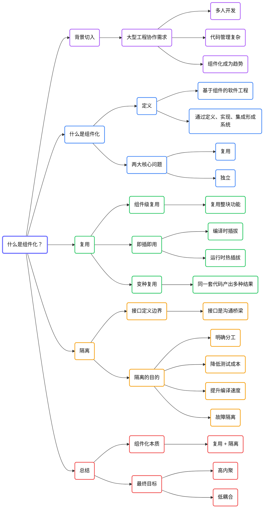

# 什么是组件化？

组件化是大型移动应用工程中经常会遇到的话题。

即使没有真正做过组件化，也必须要知道什么是组件化、它解决什么问题、为什么它会成为移动端开发中的趋势。因为对于大型应用来说，组件化已经不仅仅是一种“可选优化”，而是在多人协作和大型工程演进过程中越来越常见的一种组织方式。

## 先从背景出发：为什么组件化越来越重要？

随着 Android 平台的发展，很多大厂应用已经演变成规模极大的工程，几十人甚至近百人共同开发一个应用并不罕见。像淘宝、微信这样的超级应用，往往还需要多个团队并行协作。

在这种背景下，传统的单体工程组织方式会逐渐暴露出很多问题，例如职责边界不清、代码耦合严重、协作效率下降、编译与测试成本过高等等。

组件化，就是为了应对这类大型工程协作和代码管理问题而出现的。

## 什么是组件化？

组件化可以理解为一种基于组件的软件工程方法，也可以叫作基于组件开发。

更准确地说，它是一种基于复用的软件开发方式，通过定义、实现和集成独立的组件，最终形成系统。

这个定义里有几个关键词很重要：

- 复用
- 独立
- 定义、实现和集成

其中，“复用组件并形成系统”和“组件之间保持独立”，可以看作组件化要解决的两大核心问题；而“定义、实现和集成”，则是组件化的一般实现路径。

## 组件化首先强调什么？

组件化首先强调的是复用，但这里的复用不是毫无目的的复用，而是为了最终形成一个系统。

与此同时，组件之间又必须保持独立。也就是说，每个组件应该尽量是隔离的、边界清晰的，不要直接和其他组件形成强耦合。

## “复用”在组件化里有哪些层次？

### 第一层：组件级别的代码复用

如果一个工具类被多个地方调用，那通常只是类级别、文件级别或函数级别的复用。

而组件化追求的，是组件级别的复用。组件可以理解为一个功能集合，或者一个完整的业务模块。换句话说，当我们复用一整块功能时，组件就是最小的代码单元。

组件化开发的目标，不只是开发出一个应用，而是开发出一批可以反复复用、并能自由组合成不同系统的组件。

这也意味着：组件化通常更适合那些功能多、形态多、版本变化多的应用。如果只是做一个功能单一的小应用，比如手电筒或计算器，而且也没有衍生版本需求，那么组件化就没有太大必要。

### 第二层：组件的即插即用

组件的即插即用，指的是一个组件应该能够在不修改自身代码的前提下，随时被集成进应用，也能随时被移除。

这个概念又可以分成两种情况：

- 编译时的即插即用：在最终 APK 编译出来之前，可以决定哪些组件进入产物。
- 运行时的热插拔：这实际上更接近插件化。

一般来说，组件化往往是插件化的前提。只有代码先做到组件独立，热插拔时才更容易保证稳定性，代码管理也会更清晰。

而即插即用成立的前提，是组件之间具有足够好的独立性，也就是组件之间不能存在强耦合。

### 第三层：组件代码的变种复用

除了复用整个组件之外，组件化还要求组件能够支持“变种复用”。

简单来说，就是同一套代码可以在不同场景下编译出不同结果。也就是在主体功能一致的前提下，通过差异化编译去适配不同版本、不同渠道、不同环境。

这也是组件化和一般代码抽取相比，非常重要的一个区别。

## 什么是隔离？

如果两个组件的代码交织在一起、互相直接调用、互相直接依赖，那显然就谈不上隔离。

组件化里的隔离，核心就是通过接口来定义组件边界，让组件之间不通过直接代码依赖来协作，而是通过接口或其他松耦合方式进行能力调用。

因此，接口可以看作：

- 组件边界的定义；
- 组件之间唯一的沟通桥梁。

## 为什么组件化一定要做隔离？

隔离并不是目的本身。隔离真正要解决的，是“隔绝变化”。

### 第一，明确职责与分工

如果两个模块彼此隔离，那么两个开发者就可以各自负责自己的模块，而不需要关心对方实现细节，只要事先约定好接口即可。这会让团队协作边界更清晰，也能减少相互干扰。

### 第二，降低测试成本

如果一个模块发生变化，而隔离做得足够好，那么测试时只需要验证这个模块本身以及接口是否仍然正常工作，而不必对所有未改动模块做大范围回归。

### 第三，提升编译速度

没有直接代码依赖，通常也意味着编译上可以做到更彻底的拆分。某些组件可以提前编译成 AAR 或 Jar，在其他组件变更时不需要重复编译。

### 第四，实现故障隔离

当某个组件出现问题时，如果组件之间足够隔离，就更容易做到让故障局限在本组件内部，不影响其他模块的正常运行。若进一步配合插件化，甚至可以实现更灵活的热拔除。

归根结底，隔离的目的，还是大家非常熟悉的那六个字：高内聚、低耦合。

## 总结

如果用一句话来概括组件化，它就是：通过定义、实现和集成独立组件，以实现复用、隔离和系统化组合的一种工程组织方式。

组件化要解决的两大核心问题是：

- 复用
- 隔离

围绕这两个目标，又会进一步延伸出即插即用、变种复用、协作边界、测试成本、编译效率和故障隔离等一系列工程收益。

至于如何具体实现组件化，会在后续内容中继续展开。

## 横向脑图

