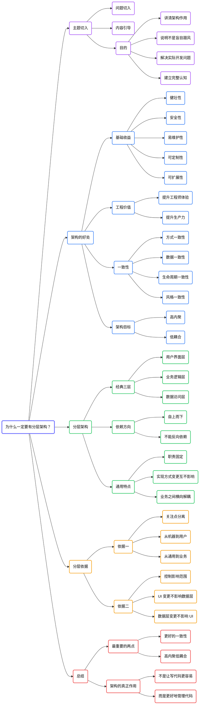

# 为什么一定要有分层架构？

为什么一定要有分层架构？这是理解后续架构讨论的起点。

这个问题也可以看作这组内容的起点。本文的核心目标，是帮助大家建立一个完整的逻辑闭环，把架构的作用讲清楚，并且说明：我们使用某种架构，不是盲目跟风，也不是人云亦云，而是为了真正解决实际开发中遇到的问题。

## 先说什么是架构

在讨论分层架构之前，先说说架构本身。关于“架构是什么”，大家可能都有自己的理解，其实没有必要一定去得出一个非常书面的定义。比起定义，更重要的是架构究竟能带来什么好处，以及分层架构为什么通常能带来更多收益。

## 架构能够带来什么好处？

架构能够带来的好处，首先体现在几个基础层面：

- 健壮性：凡是有助于程序稳定运行的因素，都可以归结到健壮性里。
- 安全性：包括网络安全、代码安全，以及用户账号和隐私安全。
- 易维护性：体现在多人协作以及代码规模膨胀之后的维护成本上。
- 可定制性：指一个功能或模块可以针对不同需求呈现出不同形态。
- 可扩展性：指增加新功能或扩展新模块时，不需要大量修改已有代码，而是能够得到现有代码的直接支持。

这些都是软件架构能够直接带来的收益。健壮性和安全性会提升用户体验，而架构更大的价值，其实体现在工程师体验上。一个好的架构，能够显著提升使用它的工程师的生产力。

## 架构会不会降低研发效率？

这个问题需要分两面来看。

架构的本质，其实是一种通过技术手段落地的编程规范。只要引入规范，就有可能在局部上增加成本。

从单一功能的角度来看，如果我们把所有业务逻辑和 UI 代码都随意地写进一个 Activity 里，的确可能很快完成一个功能；但这样做几乎没有维护性可言。反过来，如果项目明明没有可定制化需求，却选择了一个以可定制为目标的架构，就会在实现过程中被架构拖累，做出很多本来不必要的工作，这就是典型的过度设计。

所以，从局部来看，架构有可能妨碍研发效率；但从整个工程来看，维护性、可扩展性和可定制性的提升，都会带来更好的代码复用和更低的维护成本。而维护成本的下降，本质上就是人力成本的下降。因此，从工程效率的角度来看，架构通常会带来更大的研发效率提升。

## 更具体一点：架构究竟解决了哪些问题？

如果把前面的收益说得更具体一些，架构首先解决的是“一致性”问题。

第一，方式一致性。  
有了架构之后，我们就可以用相似的方式去解决相似的问题、实现相似的功能，这有助于提高代码的维护性和健壮性，因为复用成熟做法通常更不容易出错。

第二，数据一致性。  
很多人会觉得，只要服务器不出错，客户端就不太需要关心数据一致性。但实际上，客户端更容易出现数据一致性问题，例如多页面、多进程，甚至多数据库之间的数据同步，都非常容易出问题。

第三，生命周期一致性。  
页面实例的生命周期管理如果没有统一方式，就会非常混乱，而客户端往往恰恰需要管理大量生命周期。

第四，风格一致性。  
在团队开发中，统一的代码风格也属于架构价值的一部分。

这四点本质上都在解决一致性问题。架构帮助我们保证一致性，而保证一致性的目的，就是让不同工程师写出的代码尽量一致，让不同页面、不同功能之间的数据源和生命周期也尽量一致。

## 除了一致性，架构还能带来什么？

除了保证一致性，架构还能够帮助我们做到：

- 修改一个功能时，不影响其他功能。
- 让一个模块只承担一个职责，符合单一职责原则。
- 减少功能之间的直接依赖。
- 通过依赖倒置隐藏实现细节。

把这些收益总结起来，其实就是为了达到高内聚、低耦合。

## 什么是分层架构？

分层架构可以说是使用最广泛的一类架构模式。

最经典的分层架构，会把系统划分为三层：用户界面层、业务逻辑层和数据访问层。层与层之间的关系是自上而下的依赖，不能反向依赖。

再比如近几年比较常被提到的 DDD，也就是领域驱动设计，同样提供了四层结构的分层架构。无论具体怎么分，完整的分层架构都有一些共同特点：

- 每一层的职责是相对固定的。
- 每一层实现方式的改变，不应该影响其他层的依赖关系。
- 整体依赖方向仍然是自上而下的单向依赖。
- 不同业务之间的代码也要做到横向解耦。

## 分层的依据是什么？

### 第一个依据：符合关注点分离原则

每一层的关注点应该不同。层次越往上，离用户越近；层次越往下，离机器越近。也可以理解为：从抽象到具体、从通用到业务，各层只关注自己所处的抽象层次。

比如，数据层更关注底层存储和通用的数据能力；用户界面层更关注页面绘制和用户交互。数据层更原始、更通用，用户界面层则更贴近业务。

因此，用户界面层最好只关心页面如何绘制、用户如何接收和触发事件；数据层最好只关心数据如何存储，以及如何向上提供数据。

### 第二个依据：控制修改带来的影响范围

分层的第二个依据，是看修改技术方案或代码时，对其他层会产生什么影响。

比如，UI 层的实现如果从 XML 布局切换到 Jetpack Compose，就不应该影响数据层的正常运行。反过来，如果数据层修改了数据库访问方式，也不应该导致业务逻辑变化，更不应该影响 UI 层的绘制方式。

## 分层之后，各层如何协作？

关于分层之后各层之间如何具体协作，会在后续内容中继续展开。后续内容也会介绍安卓平台上一些常见的架构模式，以及它们之间的差异。

## 总结

架构最重要的价值，集中在两个方面：

- 让整个应用拥有更好的一致性，减少团队开发中的各种阻碍。
- 让整个应用的代码达到高内聚、低耦合的状态。

最后再总结一句：架构并不是让写代码本身变得更容易，架构真正的作用，是帮助我们更好地管理代码。

关于分层架构的基础讨论，先梳理到这里。更具体的架构模式会在后续内容中展开。

## 横向脑图

