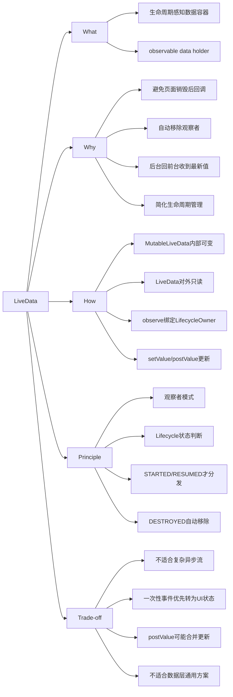

简洁结论：**LiveData 是 Android Jetpack 中一个具有生命周期感知能力的可观察数据容器，常用于 ViewModel 向 Activity/Fragment 暴露 UI 状态。** 它的核心价值是让 UI 层安全地观察数据变化，避免页面销毁后继续回调导致崩溃或内存泄漏。不过在 Kotlin 协程、Flow 和 Compose 体系下，很多新项目会优先使用 `StateFlow` 或 Compose `State` 表达 UI 状态；`SharedFlow` 更适合需要广播式、多消费者语义的流，不应被简单当成所有一次性 UI 事件的默认解法。

## 1. What：它是什么？

LiveData 是 Jetpack Lifecycle 组件中的一个 **observable data holder class**，也就是“可观察的数据持有者”。

它和普通观察者模式最大的区别是：**LiveData 具备生命周期感知能力**。

LiveData 通常和以下组件一起出现：

- `LiveData<T>`：对外暴露的只读数据。
- `MutableLiveData<T>`：内部可修改的数据。
- `Observer<T>`：数据变化的观察者。
- `LifecycleOwner`：生命周期拥有者，例如 Activity、Fragment。
- `ViewModel`：通常持有 LiveData，并向 UI 层暴露状态。

官方文档中对 LiveData 的核心定义是：它是一个生命周期感知的数据容器，只会通知处于活跃生命周期状态的观察者。这里的活跃状态通常指 `STARTED` 或 `RESUMED`。

面试中可以一句话概括：**LiveData 是一个生命周期感知的观察者模式实现，主要用于在 ViewModel 和 UI 层之间传递可观察的 UI 数据。**

## 2. Why：它解决了什么问题？

LiveData 主要解决的是 UI 层观察数据时的生命周期安全问题。

在 Android 中，Activity 和 Fragment 生命周期复杂。如果直接用普通回调、接口监听、Rx 或普通 Flow 收集数据，开发者需要自己保证订阅和取消订阅跟生命周期对齐。Flow 本身也不自动感知 Android 生命周期，UI 层通常要配合 `repeatOnLifecycle`、`flowWithLifecycle` 或 Compose 的 `collectAsStateWithLifecycle`。处理不当容易出现：

- Activity/Fragment 已经销毁，但回调仍然触发，导致崩溃。
- 观察者没有及时移除，导致内存泄漏。
- 屏幕旋转后 UI 重建，状态同步逻辑复杂。
- 数据变化后手动刷新 UI，代码分散在多个生命周期方法中。
- UI 层既处理状态，又处理数据订阅，Activity/Fragment 变得臃肿。

LiveData 的价值是：**让 UI 组件只在 `STARTED` 或 `RESUMED` 这类活跃状态下接收数据更新，并在生命周期进入 `DESTROYED` 时自动移除观察者。**

典型场景是 ViewModel 保存页面状态，Activity/Fragment 只负责观察和渲染：

```text
Repository -> ViewModel -> LiveData -> Activity/Fragment
```

这样职责更清晰：

- Repository 负责数据来源。
- ViewModel 负责准备和保存 UI 状态。
- Activity/Fragment 负责观察数据并更新界面。

## 3. How：它怎么使用？

### 3.1 在 ViewModel 中暴露 LiveData

常见写法是在 ViewModel 内部使用 `MutableLiveData`，对外暴露不可变的 `LiveData`，避免外部直接修改状态。

```kotlin
class UserViewModel : ViewModel() {

    private val _userName = MutableLiveData<String>()
    val userName: LiveData<String> = _userName

    fun loadUserName() {
        _userName.value = "Android"
    }
}
```

这种封装方式体现了一个重要原则：**ViewModel 内部可以修改状态，UI 层只能观察状态。**

### 3.2 在 Activity 中观察 LiveData

```kotlin
class UserActivity : AppCompatActivity() {

    private val viewModel: UserViewModel by viewModels()

    override fun onCreate(savedInstanceState: Bundle?) {
        super.onCreate(savedInstanceState)

        viewModel.userName.observe(this) { name ->
            userNameTextView.text = name
        }
    }
}
```

这里的 `this` 是 `LifecycleOwner`。当 Activity 处于活跃状态时，观察者会收到数据更新；当 Activity 被销毁时，观察者会自动移除。

### 3.3 在 Fragment 中观察 LiveData

Fragment 中推荐使用 `viewLifecycleOwner`：

```kotlin
class UserFragment : Fragment(R.layout.fragment_user) {

    private val viewModel: UserViewModel by viewModels()
    private var _binding: FragmentUserBinding? = null
    private val binding get() = _binding!!

    override fun onViewCreated(view: View, savedInstanceState: Bundle?) {
        super.onViewCreated(view, savedInstanceState)
        _binding = FragmentUserBinding.bind(view)

        viewModel.userName.observe(viewLifecycleOwner) { name ->
            binding.userNameText.text = name
        }
    }

    override fun onDestroyView() {
        super.onDestroyView()
        _binding = null
    }
}
```

面试中这点很重要：**Fragment 有自己的生命周期，也有 View 的生命周期。只要观察结果会更新 View，就应该使用 `viewLifecycleOwner`。**

如果直接使用 Fragment 本身作为 `LifecycleOwner`，可能出现 Fragment View 销毁后观察者仍然存在的问题，从而持有旧 View 或旧 Binding，引发内存泄漏或空指针问题。使用 ViewBinding 时，也应该在 `onDestroyView()` 中清空 binding 引用。

### 3.4 setValue 和 postValue

更新 LiveData 常见有两种方式：

```kotlin
_userName.value = "main thread"
```

等价于 `setValue()`，需要在主线程调用。

```kotlin
_userName.postValue("background thread")
```

`postValue()` 可以在子线程调用，它会把更新任务投递到主线程执行。

需要注意两点：

- 如果短时间内连续多次调用 `postValue()`，主线程还没来得及执行时，中间值可能会被合并，最终只分发最后一次值。
- 如果先调用 `postValue("a")`，又在主线程立刻调用 `setValue("b")`，观察者会先收到 `"b"`，之后主线程执行之前投递的任务时再收到 `"a"`。

因此，如果业务要求每个事件都不能丢，或者要求严格的事件顺序，LiveData 不一定合适。

### 3.5 Transformations 和 MediatorLiveData

LiveData 也支持一些简单的数据转换：

```kotlin
val displayName: LiveData<String> = userName.map { name ->
    "User: $name"
}
```

多个 LiveData 数据源可以用 `MediatorLiveData` 合并：

```kotlin
val result = MediatorLiveData<String>()

result.addSource(sourceA) { value ->
    result.value = value
}

result.addSource(sourceB) { value ->
    result.value = value
}
```

需要注意，`map`、`switchMap` 这类 LiveData 转换函数会在主线程执行，所以里面不应该做耗时计算或阻塞式 I/O。不过如果涉及复杂异步流、组合、切换、错误处理，Kotlin Flow 通常更合适。

## 4. Principle：它的核心原理是什么？

LiveData 的核心原理可以概括为：**观察者模式 + Lifecycle 生命周期感知 + 主线程分发 + 最新值缓存。**

### 4.1 观察者模式

LiveData 内部维护一组观察者。当数据发生变化时，它会遍历观察者并尝试分发新值。

```text
LiveData
  -> Observer A
  -> Observer B
  -> Observer C
```

但它不是无条件分发，而是会结合生命周期状态进行判断。

### 4.2 生命周期感知

当调用：

```kotlin
liveData.observe(lifecycleOwner, observer)
```

LiveData 会把观察者和 `LifecycleOwner` 绑定起来。

只有当 `LifecycleOwner` 的状态是 `STARTED` 或 `RESUMED` 时，观察者才被认为是 active observer，也就是活跃观察者。只有活跃观察者会收到数据更新。生命周期低于 `STARTED` 时，例如 `ON_STOP` 之后回到 `CREATED`，观察者仍然注册着，但会变成非活跃状态，不再接收分发。

如果 `LifecycleOwner` 进入 `DESTROYED` 状态，LiveData 会自动移除对应观察者。

### 4.3 最新值缓存

LiveData 会保存最近一次设置的值。

如果数据变化时页面处于非活跃状态，它不会立刻通知该页面。等页面重新进入活跃状态后，它会收到最新可用值。更准确地说，观察者从非活跃变为活跃时会收到当前值；如果它之前已经收到过同一个值，第二次从非活跃回到活跃时不会因为生命周期变化而重复收到这个旧值。

这对 UI 状态很有用。例如页面从后台回到前台时，能直接拿到最新的用户信息、列表状态或加载状态。

但这也带来了“粘性”特征：新观察者开始观察后，可能立刻收到上一次的值。这对状态是合理的，但对一次性事件可能不合理。

### 4.4 onActive 和 onInactive

LiveData 还提供两个生命周期相关回调：

```kotlin
override fun onActive() {
    // 第一个活跃观察者出现时调用
}

override fun onInactive() {
    // 活跃观察者数量从 1 变为 0 时调用
}
```

`onInactive()` 不等于“没有观察者”，而是“没有活跃观察者”；例如 Activity 进入后台时，观察者可能还在，只是生命周期状态低于 `STARTED`。自定义 LiveData 时可以利用它们控制资源启动和释放，例如开始或停止监听系统服务。不过现在业务开发中直接自定义 LiveData 的场景已经不多，更多会使用 Flow 或 Repository 层封装数据源。

## 5. Trade-off：局限、缺点、常见坑和替代方案

LiveData 的优点是简单、生命周期安全、和 ViewModel/Activity/Fragment 配合自然。但它也有明显局限。

### 5.1 不适合复杂异步流处理

LiveData 更偏向 UI 状态观察，不擅长复杂异步数据流处理。官方文档也提醒，不要在 Repository 中把 LiveData 当作复杂异步流处理工具，因为 LiveData 的转换运行在主线程，容易把耗时逻辑推到 UI 线程上。

例如：

- 多个流组合
- 数据流切换
- 背压处理
- 复杂错误恢复
- 链式异步转换
- 多消费者共享数据流

这些场景 Kotlin Flow、StateFlow、SharedFlow 通常更灵活。

### 5.2 一次性 UI 事件不要直接塞进 LiveData

LiveData 会保存最新值，因此用于 Toast、Snackbar、页面跳转、弹窗这类一次性事件时容易出现重复消费。

例如屏幕旋转后，新的 Fragment 重新观察 LiveData，可能再次收到旧的导航事件，导致重复跳转。

更符合 Android 架构文档的处理方式是：**把 ViewModel 产生的 UI 动作先归约为 UI 状态**。例如用 `userMessage: String?`、`isUserLoggedIn: Boolean`、`navigateToDetailId: String?` 这类状态字段表达“当前界面应该显示什么或进入什么状态”。UI 观察到状态后执行显示 Snackbar、导航等 UI 行为，并在消费后调用 ViewModel 方法清除或确认该状态。

`SharedFlow`、`Channel` 或事件包装类不是完全不能用，但它们需要团队明确生命周期收集、`replay`、缓冲和丢弃策略。当 ViewModel 比 UI 活得更久时，这些方案并不天然保证事件一定被处理。更适合它们的场景通常是周期 tick、刷新通知、广播式多消费者流，或者允许丢弃的非关键瞬时信号。

面试中可以说：**LiveData 更适合表达状态，不适合直接表达事件；ViewModel 发出的 UI 事件优先转成可恢复、可测试的 UI 状态。**

### 5.3 postValue 可能合并更新

`postValue()` 会把更新任务投递到主线程。如果在主线程执行前连续调用多次，只会分发最后一次值。

例如：

```kotlin
liveData.postValue(1)
liveData.postValue(2)
liveData.postValue(3)
```

观察者通常只会收到 `3`。因此，如果业务要求每个中间值都不能丢，比如日志、事件流、进度细节，LiveData 不是最合适的选择。

### 5.4 observeForever 需要手动移除

`observeForever()` 不绑定 `LifecycleOwner`，观察者会一直保持活跃。

```kotlin
liveData.observeForever(observer)
```

这种方式必须在合适时机调用：

```kotlin
liveData.removeObserver(observer)
```

否则容易造成内存泄漏。面试中可以强调：**普通 UI 层观察优先使用 `observe(lifecycleOwner)`，谨慎使用 `observeForever()`。**

### 5.5 Fragment 中不要直接用 this 更新 View

Fragment 中观察 LiveData 更新 UI 时，应该使用：

```kotlin
observe(viewLifecycleOwner)
```

而不是：

```kotlin
observe(this)
```

因为 Fragment 实例可能还存在，但它的 View 已经销毁。使用错误的生命周期拥有者，会增加内存泄漏和 UI 崩溃风险。

### 5.6 不适合作为数据层通用响应式方案

LiveData 和 Android Lifecycle 绑定较深，不适合在纯 Kotlin 数据层、Repository 层或跨平台模块中作为通用响应式类型。Repository 层如果需要表达连续数据变化，通常优先暴露 `Flow`，把生命周期感知留给 UI 层或 ViewModel 层处理。

更合理的做法是：

```text
DataSource / Repository -> Flow
ViewModel -> StateFlow 或 LiveData
UI -> observe / collect
```

也就是说，数据层可以使用 Flow，UI 层再根据项目技术栈选择暴露 LiveData 或 StateFlow。

### 5.7 类似技术对比

**LiveData vs StateFlow**

二者都可以表达 UI 状态，也都会保留最新值。

区别是：

- `LiveData` 不要求初始值，`StateFlow` 必须有初始值。
- `LiveData.observe()` 会在生命周期低于 `STARTED` 时停止分发，并在 `DESTROYED` 时自动移除观察者。
- `StateFlow` 本身不自动感知 Android 生命周期，UI 层需要配合 `repeatOnLifecycle`、`flowWithLifecycle` 或 `collectAsStateWithLifecycle`。
- `StateFlow` 更适合 Kotlin 协程体系，适合新项目或 Compose 项目。

**LiveData vs SharedFlow**

`LiveData` 更适合表达界面状态。`SharedFlow` 是热流，可以向多个收集者发送值，并通过 `replay`、缓冲和溢出策略控制分发行为，更适合周期 tick、刷新通知、广播式多消费者流等场景。

Toast、Snackbar、导航这类由 ViewModel 推动的 UI 行为，不应简单地说“更适合 SharedFlow”。按照官方 UI events 指南，优先把它们建模成 UI state，由 UI 根据状态执行行为，并在处理后通知 ViewModel 清除状态；只有在明确接受丢弃、重复或缓冲语义时，才考虑直接使用 `SharedFlow` 或 `Channel`。

**LiveData vs RxJava Observable**

RxJava 功能更强，适合复杂异步流、线程切换、组合操作。但它不天然感知 Android 生命周期，需要额外管理订阅释放。

LiveData 功能更轻量，生命周期安全更简单，但流式操作能力弱。

**LiveData vs Compose State**

在 View 系统中，LiveData 和 Activity/Fragment 配合自然。

在 Compose 中，UI 更推荐使用 Compose `State`、`remember`、`rememberSaveable`、`StateFlow` 等状态模型。如果 ViewModel 暴露的是 LiveData，也可以通过 `observeAsState()` 转成 Compose 可观察状态。

**LiveData vs ViewModel**

ViewModel 是状态持有者，LiveData 是 ViewModel 暴露状态的一种方式。

二者不是替代关系，而是配合关系：

```text
ViewModel 持有状态
LiveData 暴露状态变化
Activity/Fragment 观察状态并渲染 UI
```

## 面试口述版

LiveData 是 Android Jetpack Lifecycle 组件中的一个生命周期感知型可观察数据容器，常用于 ViewModel 向 Activity 或 Fragment 暴露 UI 状态。它解决的核心问题是 UI 层观察数据时的生命周期安全，比如生命周期低于 `STARTED` 时不分发更新，生命周期进入 `DESTROYED` 后自动移除观察者，从而减少内存泄漏和无效回调。使用上一般是在 ViewModel 内部用 `MutableLiveData` 保存数据，对外暴露不可变的 `LiveData`，然后在 Activity 或 Fragment 中通过 `observe(lifecycleOwner)` 观察。Fragment 中如果要更新 View，应该使用 `viewLifecycleOwner`。原理上，LiveData 内部是观察者模式，同时结合 `LifecycleOwner` 判断生命周期状态，只有 `STARTED` 或 `RESUMED` 状态的活跃观察者才会收到更新，并且它会保存最新值，观察者从非活跃重新变为活跃时会收到当前最新值。它的局限是复杂异步流处理能力不如 Kotlin Flow，`map`、`switchMap` 等转换运行在主线程，处理 Toast、导航这类一次性 UI 行为时容易出现粘性和重复消费问题，`postValue` 连续调用也会合并更新。现在在协程项目中，UI 状态通常可以考虑 `StateFlow` 或 Compose `State`；ViewModel 发出的 UI 事件优先转成 UI 状态，特殊情况下才谨慎使用 `SharedFlow` 或 `Channel`。

## 参考资料

- Android Developers: LiveData overview  
  https://developer.android.com/topic/libraries/architecture/livedata
- Android Developers: LiveData API reference  
  https://developer.android.com/reference/androidx/lifecycle/LiveData
- Android Developers: StateFlow and SharedFlow  
  https://developer.android.com/kotlin/flow/stateflow-and-sharedflow
- Android Developers: UI events
  https://developer.android.com/topic/architecture/ui-layer/events
- Android Developers: Fragment lifecycle  
  https://developer.android.com/guide/fragments/lifecycle

## 思维导图


