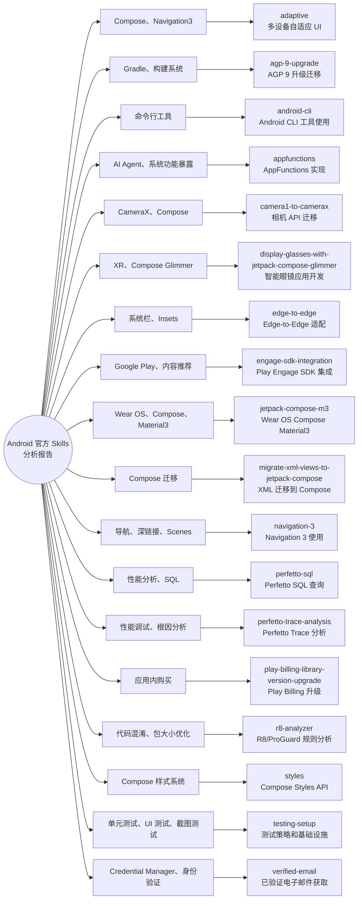

## 简介

Android Skills 是 Google 官方维护的一套面向 AI 的模块化指令仓库。它通过标准化的 `SKILL.md` 文件，为 LLM 提供 Android 开发特定领域的技术规范和工作流指导，帮助 AI 更好地理解和执行 [developer.android.com](https://developer.android.com) 上的最佳实践。

每个 Skill 本质上是一份结构化的 Markdown 技术文档，涵盖特定任务的目标、前置条件、详细步骤和验证方法。当这些 Skill 被安装到支持的 AI Agent（如 Gemini、Antigravity 等）后，Agent 就能在对话中准确调用对应的开发知识，生成更符合官方规范的代码和建议。

## 安装与使用

Android Skills 通过 [Android CLI](https://developer.android.com/tools/agents/android-cli) 进行安装和管理。

### 安装命令

```bash
android skills add [--all] [--agent=<agent-name>] [--skill=<skill-name>] [--project=<path>]
```

**常用示例：**

```bash
# 安装所有 Android Skills
android skills add --all

# 安装指定 Skill 到当前项目
android skills add --skill=r8-analyzer --project=.

# 为指定 Agent 安装
android skills add --agent=gemini --all
```

**参数说明：**

| 参数 | 说明 |
|---|---|
| `--all` | 安装所有 Android Skills。若省略且未指定 `--skill`，则默认只安装 `android-cli` Skill |
| `--agent` | 指定要安装的 Agent，支持逗号分隔的列表。若省略，则为所有检测到的 Agent 安装 |
| `--skill` | 指定要安装的单个 Skill。若省略且未指定 `--all`，则默认只安装 `android-cli` Skill |
| `--project` | 指定要安装 Skills 的项目根目录路径 |

### 安装路径

如果没有检测到现有的 Agent 目录且未指定特定 Agent，Skills 默认会为 Gemini 和 Antigravity 安装到以下路径：

```
~/.gemini/antigravity/skills
```

### 官方资源

- [Android Skills 官方文档](https://developer.android.com/tools/agents/android-skills)
- [Android CLI 文档](https://developer.android.com/tools/agents/android-cli)
- [Android Studio Skills 文档](https://developer.android.com/studio/gemini/skills)

> **注意**：AI 生成的内容可能存在错误，建议在实际应用中始终对结果进行复核。

## 总结

| Skill 名称 | 主要用途 | 技术领域 |
|---|---|---|
| adaptive | 多设备自适应 UI | Compose、Navigation3 |
| agp-9-upgrade | AGP 9 升级迁移 | Gradle、构建系统 |
| android-cli | Android CLI 工具使用 | 命令行工具 |
| appfunctions | AppFunctions 实现 | AI Agent、系统功能暴露 |
| camera1-to-camerax | 相机 API 迁移 | CameraX、Compose |
| display-glasses-with-jetpack-compose-glimmer | 智能眼镜应用开发 | XR、Compose Glimmer |
| edge-to-edge | Edge-to-Edge 适配 | 系统栏、Insets |
| engage-sdk-integration | Play Engage SDK 集成 | Google Play、内容推荐 |
| jetpack-compose-m3 | Wear OS Compose Material3 | Wear OS、Compose、Material3 |
| migrate-xml-views-to-jetpack-compose | XML 迁移到 Compose | Compose 迁移 |
| navigation-3 | Navigation 3 使用 | 导航、深链接、Scenes |
| perfetto-sql | Perfetto SQL 查询 | 性能分析、SQL |
| perfetto-trace-analysis | Perfetto Trace 分析 | 性能调试、根因分析 |
| play-billing-library-version-upgrade | Play Billing 升级 | 应用内购买 |
| r8-analyzer | R8/ProGuard 规则分析 | 代码混淆、包大小优化 |
| styles | Compose Styles API | Compose 样式系统 |
| testing-setup | 测试策略和基础设施 | 单元测试、UI 测试、截图测试 |
| verified-email | 已验证电子邮件获取 | Credential Manager、身份验证 |


## 1. adaptive

**作用**：指导如何使 Android 应用的 UI 适配不同设备形态，包括手机、平板、折叠屏、笔记本电脑、桌面设备、TV、Auto 和 XR。

**核心内容**：
- 使用 Compose MediaQuery API 处理不同窗口尺寸、指针设备（如鼠标）和文本输入设备（如键盘）
- 使用 Navigation3 Scenes 实现多窗格布局（List-Detail、Supporting Pane）
- 使用 Compose Grid 和 FlexBox API 构建自适应布局
- 自适应导航区域（底部导航栏 ↔ 导航边栏）的迁移
- 垂直列表自适应（根据屏幕宽度调整列数）
- 滚动时隐藏 App Bar 的行为

**前置条件**：应用必须使用 Compose 和 Jetpack Navigation 3

---

## 2. agp-9-upgrade

**作用**：将 Android 项目升级或迁移到 Android Gradle Plugin (AGP) 版本 9。

**核心内容**：
- 检查当前 AGP 版本，要求用户先通过 Android Studio 的 AGP Upgrade Assistant 更新
- 更新 KSP 和 Hilt 等依赖版本
- 迁移到内置 Kotlin（built-in Kotlin）
- 迁移到新的 AGP DSL
- 将 kapt 迁移到 KSP 或 legacy-kapt
- 处理 BuildConfig 变更
- 更新 gradle.properties（移除旧版 flag）

**限制**：不适用于 Kotlin Multiplatform (KMP) 项目

---

## 3. android-cli

**作用**：使用 `android` 命令行工具编排 Android 开发任务。

**核心内容**：
- SDK 管理（安装、更新、移除、列出 SDK 包）
- 从模板创建项目
- 与运行中的设备交互
- 运行 journey 测试
- 搜索 Android 开发者文档（`android docs`）
- 部署和运行 APK
- 管理模拟器（创建、启动、停止、列出、删除 AVD）
- 捕获设备截图
- 管理 agent skills
- 检查 UI 布局树（JSON 格式输出）
- 更新 Android CLI 自身

---

## 4. appfunctions

**作用**：分析 Android 应用以识别关键用户工作流，生成 AppFunctions 的 Kotlin 实现代码，使系统代理（AI Agent）能够发现和执行这些功能。

**核心内容**：
- **Step 1: Discovery** - 分析代码库识别高价值 AppFunctions
- **Step 2: Implementation & Configuration** - 生成 AppFunctions 的 Kotlin 实现、系统配置、Hilt 配置
- **Step 3: KDoc Refinement** - 优化 AppFunction KDoc，使 AI 代理和 MCP 正确理解功能
- **Step 4: Testing & Debugging** - 使用 ADB 命令进行本地测试和调试

**前置条件**：`targetSdk >= 36`，`compileSdk >= 37`

---

## 5. camera1-to-camerax

**作用**：将旧版 Android 相机实现（Camera1 或原始 Camera2 API）迁移到 CameraX。

**核心内容**：
- 添加 CameraX 依赖（camera-core、camera-camera2、camera-lifecycle、camera-view、camera-compose）
- 删除旧版 Camera 实现（SurfaceView、SurfaceHolder、手动生命周期管理、手动矩阵计算）
- 初始化 ProcessCameraProvider 并绑定到 LifecycleOwner
- 实现预览和点击对焦（支持 Android Views 和 Jetpack Compose 两种模式）
- 使用 ImageCapture 拍照处理
- 切换前后摄像头

**关键约束**：不要手动管理相机生命周期；不要手动计算对焦矩阵；记得关闭 ImageProxy

---

## 6. display-glasses-with-jetpack-compose-glimmer

**作用**：为 Display Glasses（智能眼镜）开发 Android XR 增强体验应用，使用 Jetpack Compose Glimmer UI 工具包。

**核心内容**：
- 支持 Intelligent Eyewear（包括 audio glasses 和 display glasses）
- 创建 Projected Activity（Glasses Activity），UI 投影到连接的眼镜设备
- 使用 `GlimmerTheme` 而非 `MaterialTheme`
- 使用 `createGoogleSansFlexTypography()` 配置 Google Sans Flex 字体
- 纯黑背景（`Color.Black`），因为 Display Glasses 使用 Additive Display（黑色渲染为透明）
- 最小化 UI 覆盖，底部对齐，一次只显示一个主要信息
- 支持深度效果（DepthEffect）建立视觉层次、焦点管理
- 核心组件：Card、Button、TitleChip、Icon、List、Stack、Text、Surface
- Glimmer Text 自动管理主题颜色，避免 Material Text 在透明屏幕上不可见的问题
- 将触摸板输入映射到应用交互、与系统 UI 集成（通知等）

**前置条件**：`compileSdk >= 37`

---

## 7. edge-to-edge

**作用**：为 Jetpack Compose 应用添加自适应 Edge-to-Edge 支持，修复 UI 组件被导航栏或状态栏遮挡的问题。

**核心内容**：
- 在每个 Activity 的 `onCreate` 中调用 `enableEdgeToEdge()`
- 在 AndroidManifest.xml 中为使用软键盘的 Activity 设置 `android:windowSoftInputMode="adjustResize"`
- 应用系统 Insets：使用 Scaffold 的 `PaddingValues`、Material 组件的自动 inset 处理、`Modifier.safeDrawingPadding()`、`WindowInsetsRulers`
- IME（输入法）处理：使用 `fitInside(WindowInsetsRulers.Ime.current)` 或 `imePadding()`
- 导航栏对比度和系统栏图标颜色设置
- 列表的 `contentPadding` 处理
- 全屏 Dialog 的 Edge-to-Edge 设置
- 提供详细的对错代码示例

**前置条件**：项目必须使用 Jetpack Compose，target SDK >= 35

---

## 8. engage-sdk-integration

**作用**：帮助开发者集成、调试和解决 Play Engage SDK 实现问题。

**核心内容**：
- 识别应用所属的行业垂直领域（Food、Watch、Listen、Read、Shopping、Social、Travel 等）
- 生成结构化样板代码（Constants、ItemToEntityConverter、ClusterRequestFactory、EngageWorker、EngagePublisher、EngageBroadcastReceiver）
- 将应用的本地数据模型映射到 Engage 实体
- 更新 Gradle 和 AndroidManifest.xml
- 支持 Mobile 和 TV 平台
- 调试：修复导入错误、编译问题
- 用户检查清单验证

---

## 9. jetpack-compose-m3

**作用**：为 Wear OS 项目提供使用 Jetpack Compose Material3 的专家指导，包括创建、更新和迁移。

**核心内容**：
- 涵盖 `androidx.wear.compose.material3`、`androidx.wear.compose.foundation`、`androidx.wear.compose.navigation3` 库
- 核心组件：`AppScaffold`（外层容器，唯一）、`ScreenScaffold`（子级，可多个）、`TransformingLazyColumn`
- 从早期版本（Material 2.5、Horologist）迁移到 Material3
- 强制要求从样本 JAR（`<artifact>-<version>-samples-sources.jar`）中提取并阅读官方组件样例，不允许仅凭文档推断 API
- 组件指导清单：使用 `TransformingLazyColumn` 替代 `ScalingLazyColumn`、使用 `transformedHeight` 和 `SurfaceTransformation`、`EdgeButton` 的正确使用方式（不要作为列表最后一项，使用 `ScreenScaffold` 的 slot）
- 样式规则：不要硬编码文本大小和颜色，使用 `MaterialTheme` 的 `typography` 和 `colorScheme`
- 使用组件的 `*Defaults` 对象处理 padding 和样式
- 版本升级后必须进行 Gradle Sync 再重构代码

**前置条件**：Kotlin >= 2.0.0、`minSdk >= 25`（Wear OS 2.0）；Kotlin 2.0+ 时需使用 `org.jetbrains.kotlin.plugin.compose` Gradle 插件

---

## 10. migrate-xml-views-to-jetpack-compose

**作用**：提供将 Android XML View 迁移到 Jetpack Compose 的结构化工作流。

**核心内容**：
- 10 步迁移流程：
  1. 识别最佳迁移候选
  2. 分析项目和布局
  3. 创建迁移计划
  4. 捕获 XML View UI 截图
  5. 设置 Compose 依赖和编译器
  6. 设置 Compose 主题
  7. 迁移 XML 布局到 Compose
  8. 替换使用位置
  9. 验证迁移（视觉对比）
  10. 移除 XML 代码
- 保持像素级视觉一致性和功能完整性
- 支持 Compose ↔ Views 互操作

---

## 11. navigation-3

**作用**：学习如何安装和迁移到 Jetpack Navigation 3，以及实现各种导航模式和功能。

**核心内容**：
- Navigation 2 到 Navigation 3 的迁移指南
- 类型安全导航（Type-Safe Navigation）
- 基础 API 用法（NavKey、NavHost、NavDisplay、Entry Provider DSL）
- 常见 UI 模式（底部导航栏 + 多返回栈）
- 深链接（基础和高级）
- Scenes：Dialog、BottomSheet、List-Detail、Two Pane、Supporting Pane
- Material Adaptive：Material List-Detail、Material Supporting Pane
- 动画自定义
- 条件导航（登录 vs 匿名）
- 模块化导航代码（Hilt / Koin）
- ViewModel 参数传递和返回结果

---

## 12. perfetto-sql

**作用**：将自然语言数据意图转换为语法有效的 Perfetto SQL 查询，并对本地 trace 文件执行查询。

**核心内容**：
- 将自然语言问题翻译为 Perfetto SQL
- 使用 `trace_processor` 执行查询
- SQL 最佳实践：使用 `CREATE OR REPLACE` 保证幂等性、`SPAN_JOIN` 分区、处理 `dur = -1`、使用 `utid`/`upid` 而非 `tid`/`pid`、使用 `GLOB` 而非 `LIKE`
- 执行协议：工具设置 → 模式和模块研究 → 起草和验证循环（最多 3 次迭代）→ 最终输出
- 查询 slice、thread、memory 等数据

---

## 13. perfetto-trace-analysis

**作用**：分析 Perfetto trace 文件，找出 Android 应用中延迟、内存或卡顿问题的根本原因。

**核心内容**：
- 初始化 scratchpad 作为证据链（Chain of Evidence）
- 审查领域提示（CPU、Graphics、I/O、IPC、Memory、Power）
- 遵循 SQL 参考的执行协议
- 调查协议：形成假设 → 计划和收集数据 → 分析和深入挖掘 → 穷尽调查
- 区分 Wall Time 和 CPU Time
- 追踪阻塞/等待线程的依赖关系
- 最终报告：总结发现、证据链、结论

---

## 14. play-billing-library-version-upgrade

**作用**：将 Android 项目从任何旧版 Google Play Billing Library (PBL) 升级到最新稳定版本。

**核心内容**：
- 发现阶段：定位 billing 依赖、初始编译测试、识别"有效版本"
- 计算迁移路径：直接迁移（2 个主版本内）或阶梯式迁移（超过 2 个主版本）
- 参考迁移指南和发布说明
- SDK 和环境对齐
- 基于意图的重构（遵循弃用说明和重构模式）
- 阶梯式迁移的逐步验证
- 最终验证清单和测试

---

## 15. r8-analyzer

**作用**：分析 Android 构建文件和 R8 keep 规则，识别冗余、过于宽泛的包级规则，以及包含库消费者 keep 规则的规则。

**核心内容**：
- 检查 build.gradle、gradle.properties 配置
- 路径选择：
  - **Path A (定量)**：R8 >= 9.3.7-dev，使用 R8 配置分析器生成 proto/json 数据
  - **Path B (启发式)**：R8 < 9.3.7-dev，手动检查 proguard-rules.pro，参考冗余规则列表
- 生成严格格式的 Markdown 报告
- 建议 Macrobenchmark 测试验证变更

**限制**：只提供研究和建议，不修改文件

---

## 16. styles

**作用**：将 Jetpack Compose Styles API 集成到 Android 项目中。

**核心内容**：
- 升级依赖（`compileSdk >= 37`，`foundation >= 1.12.0-alpha01` 或 BOM `>= 2026.04.01`）
- 启用实验性 API 编译器选项
- 分析主题结构，创建 `ComponentStyles.kt`
- 将自定义组件迁移到 Styles API：
  - 移除单独样式参数
  - 添加 `style: Style = Style` 参数
  - 使用 `MutableStyleState` 跟踪交互状态
  - 使用 `Modifier.styleable()`
  - 将硬编码值移至 `ComponentStyles`
- 支持主题级集成和自定义设计系统

**限制**：实验性 API，不支持 Material Design 组件 Styles

---

## 17. testing-setup

**作用**：分析和创建原生 Android 应用的测试策略，安装测试库，设置测试基础设施。

**核心内容**：
- 分析现有测试设置（DI 框架、单元测试框架、Mock 框架、Robolectric、Compose/Views/Espresso、截图测试、端到端测试）
- 为测试设置依赖注入框架
- 安装测试框架（JUnit4、Jacoco、Compose Testing、Espresso、Robolectric、Mockk 等）
- 为单元测试和 UI 测试创建 Fake
- 单元测试（ViewModels、Repositories、DAOs）
- UI 测试（Compose 语义匹配或 Espresso）
- 数据库测试（内存数据库）
- 截图测试（屏幕级 9 种尺寸、组件级不同主题和字体缩放）
- 导航测试（返回处理、深链接、多返回栈）
- 端到端测试（用户旅程，约占总测试 5%）
- 模拟不同窗口大小和设置
- 安装 Jacoco 测试覆盖率

---

## 18. verified-email

**作用**：在 Android Credential Manager API 上实现已验证电子邮件检索，集成安全、无 OTP 的电子邮件验证流程。

**核心内容**：
- 使用 Digital Credentials Verifier API 通过 OpenID4VP 请求获取已验证的电子邮件
- 添加 Credential Manager 依赖
- 构造包含 `GetDigitalCredentialOption` 的 `GetCredentialRequest`
- 使用 DCQL 查询请求 `email_verified`、`name`、`hd` 等 claims
- 解析 DigitalCredential 响应（SD-JWT 格式）
- 客户端初步解析 + 服务器端加密验证
- 服务器端验证：验证 issuer、SD-JWT 签名、presenter 身份（`cnf` 字段）
- 建议创建 passkey 以提供无密码登录
- WebView 支持（JavaScript Bridge）
- 适用场景：账户创建、账户恢复、重新认证

**前置条件**：`minSdk >= 28`，Google Play services `>= 25.49.x`

---

## 横向脑图


