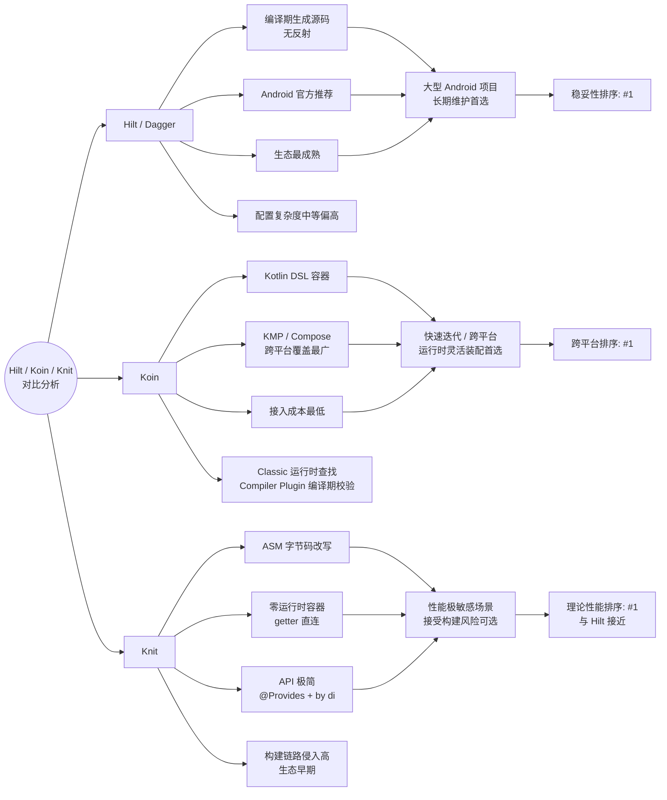

> 分析时间：2026-05-20  
> 范围说明：这里的 **Hilt** 指 Google Dagger 仓库中的 Hilt Android 方案；**Koin** 指 Koin 4.2 文档与 4.2.1 仓库发布状态；**Knit** 以 `tiktok/knit` 公开仓库源码为主，并交叉参考 Gradle Plugin Portal。

## 一句话结论

| 维度         | Hilt / Dagger                              | Koin                                                         | Knit                                                                    |
| ------------ | ------------------------------------------ | ------------------------------------------------------------ | ----------------------------------------------------------------------- |
| 核心定位     | Android 官方推荐的标准化 DI，底层是 Dagger | Kotlin / KMP 轻量 DI 容器，可选编译器插件                    | Kotlin/JVM 零中介 DI，依赖 ASM 字节码改写                               |
| 默认心智模型 | 注解声明图，编译期生成组件与工厂           | 在 `KoinApplication` 容器里注册 module，运行时或插件辅助解析 | `@Provides` 声明生产者，`by di` 声明消费者，构建时改写 getter           |
| 错误发现     | 强编译期                                   | Classic DSL 多为运行期；Compiler Plugin 可编译期校验         | 构建期 transform 绑定校验                                               |
| 运行时性能   | 通常最好，接近手写工厂调用                 | Classic 有容器查找成本；插件改善安全性但仍有容器模型         | 理论上很好，getter 被改写为直接调用/构造，无中心运行时容器              |
| 接入复杂度   | 中等偏高，Android 集成完整但约束多         | 最低；启用 Compiler Plugin 后中等                            | API 简洁，但构建链路侵入高                                              |
| 兼容面       | Android 最强；Dagger 可用于 Java/JVM       | Kotlin、Android、Compose、KMP、Ktor 覆盖最广                 | README 声称支持 JVM 与 Android；当前源码主要覆盖 Android app 与 JVM jar |
| 生态成熟度   | 最高                                       | 高                                                           | 早期，生态和工具链仍小                                                  |
| 适用优先级   | 大中型 Android、长期维护、团队协作         | KMP、快速迭代、轻量项目、需要运行时灵活装配                  | 对运行时开销极敏感、能接受字节码插件风险的 Kotlin/JVM/Android 项目      |

## 版本与资料快照

- Hilt/Dagger：`dagger.dev` 描述 Dagger 是 Java/Kotlin/Android 的 fully static、compile-time DI；最新发布为 `Dagger 2.59.2`，发布时间 2026-02-20。Android Hilt 文档示例仍使用 `2.57.1`。需要注意的是，Dagger 2.59 起如果使用 Hilt Gradle Plugin，要求 AGP 9 及其对应的 Gradle 要求；仍在 AGP 8.x 的项目不要只看最新 Dagger 版本盲目升级。
- Koin：`InsertKoinIO/koin` GitHub 页面显示最新发布为 `Koin 4.2.1`，发布时间 2026-04-10。Koin 4.2 文档推荐 Kotlin 2.x 项目使用 Koin Compiler Plugin，要求 Kotlin 2.x（K2 compiler）与 Gradle 8.x+；具体 Kotlin/插件补丁版本应跟随 Koin 官方 setup 文档和 Gradle Plugin Portal。
- Knit：公开 GitHub 页面显示仓库最新 release 为 `v0.1.2`，但 Gradle Plugin Portal 显示 `io.github.tiktok.knit.plugin` 最新版本为 `0.1.5`。所检查的 Knit 仓库 `gradle.properties` 也配置 `knitVersion=0.1.5`。

## 实现原理

### Hilt / Dagger

Hilt 是 Dagger 之上的 Android 标准化封装。Dagger 的基本机制是：

1. 使用注解描述依赖图，例如 `@Inject` 构造函数、`@Module`、`@Provides`、`@Binds`。
2. 编译期由 annotation processor / KSP 读取图。
3. 生成 Dagger component、factory、provider 等 Java/Kotlin 可调用代码。
4. 运行时调用生成代码完成对象构造、缓存和作用域管理。

Hilt 在这个基础上预置 Android 生命周期组件图。应用入口用 `@HiltAndroidApp`，Activity / Fragment / Service 等使用 `@AndroidEntryPoint`，ViewModel 用 `@HiltViewModel`。模块通过 `@InstallIn(Component::class)` 指定绑定进入哪个 Hilt component。Android 文档明确说明 Hilt 会为 Android class 生成对应 component，并管理生命周期。

关键特征：

- 依赖图在编译期确定，运行时基本是直接方法调用和 provider/factory 调用。
- Dagger 不使用反射或运行时代码生成。
- Hilt 通过预设组件层级降低 Android 手写 Dagger component 的样板代码。
- 日常 Android 入口主要使用 Hilt 预设组件层级和作用域，扩展点包括 `@EntryPoint`、自定义 module、scope、qualifier。Hilt 也支持 `@DefineComponent` 自定义组件，但官方文档强调它有父子层级限制并会增加复杂度，通常应先评估普通 Dagger component 或显式传参是否足够。

### Koin

Koin 的 Classic 形态是一个 Kotlin DSL 驱动的轻量容器：

1. 用 `module { ... }` 声明 definitions。
2. 用 `single`、`factory`、`scoped`、`viewModel` 等定义生命周期。
3. 启动时 `startKoin { modules(...) }` 创建并注册 `KoinApplication` / `GlobalContext`。
4. 运行时通过 `get()`、`inject()` 或 Android/Compose 扩展从容器中按类型、qualifier、scope 查找实例。

Koin 4.2 的重要变化是 Compiler Plugin：它是 K2 Kotlin Compiler Plugin，可自动识别构造函数依赖、做编译期分析，支持 DSL 与 annotations，并且"不生成可见文件"。这让 Koin 从"主要运行期校验"提升到"可编译期校验"，但整体运行模型仍是 Koin 容器、module、definition、scope。

关键特征：

- Classic DSL 无需注解处理和代码生成，接入轻。
- Compiler Plugin DSL 提供 `single<Foo>()`、`factory<Foo>()`、`viewModel<Foo>()` 等自动装配和编译期安全。
- 容器可全局，也可局部隔离，适合 SDK、测试、多上下文场景。
- KMP 支持是三者中最完整的。

### Knit

Knit 的设计不是注解处理器，也不是运行时容器。它的公开 README 将其定义为"purely static, compile-time safe"和"zero-intermediary dependency injection"。从当前源码看，Knit 的机制是：

1. 开发者用 `@Provides` 标记生产者，用 `val x: T by di` 标记消费者。
2. `di` 在源码中只是一个 delegate stub；如果没有被 Knit 改写，访问会抛 `NotImplementedError`。
3. Gradle 插件在构建时收集 jar / class directory 中的 `.class` 文件。
4. `GraphPipeline` 建立 class 继承图，`CollectInfo` 收集 `@Component`、`@Provides`、`by di` 等元信息。
5. `InjectionBinder` 在构建期为每个被注入的 getter 选择唯一 provider，处理默认注入、Factory 注入和 multibinding。
6. `ComponentWriter` 用 ASM 重写 getter 字节码，把 `by di` stub 替换成实际构造、provider 调用或 singleton backing field 访问。

Knit 的依赖查找规则在项目文档里写得很明确：优先自身、继承关系、组合组件、全局 providers，最后处理 `List` / `Set` 等 multibinding；同一类型冲突会在构建阶段报错。组件可以通过 `@Component` 属性组合，也可以通过父类/接口继承共享 provider。

关键特征：

- 运行时没有中心 DI container；注入点被改成普通字节码。
- `@Singleton` 通过 backing field 和首次访问逻辑实现。
- Android ViewModel 需要 `@KnitViewModel` 与 `knitViewModel()` 这类特殊 delegate。
- Android 接入当前源码使用 AGP `ScopedArtifacts.Scope.ALL` transform；JVM 接入生成 `jarWithKnit` / `shadowJarWithKnit`。

## 接入复杂度

| 项目          | Hilt / Dagger                                                                                | Koin                                                             | Knit                                                                   |
| ------------- | -------------------------------------------------------------------------------------------- | ---------------------------------------------------------------- | ---------------------------------------------------------------------- |
| Gradle 配置   | 需要 Hilt Gradle plugin、`hilt-android`、`hilt-android-compiler`，Kotlin 项目通常配 KSP/KAPT | Classic 只需 Koin 依赖；Compiler Plugin 需要额外 plugin          | 需要 `io.github.tiktok.knit.plugin` 和 `knit` / `knit-android` runtime |
| 应用入口      | `@HiltAndroidApp` 必须加在 Application                                                       | `startKoin { modules(...) }`                                     | Android app module 应用 plugin；普通类可直接 `@Provides` / `by di`     |
| Android class | Activity/Fragment/Service/ViewModel 等按 Hilt 规则标注                                       | 用 Android/Compose 扩展，如 `androidContext`、`viewModel`        | Activity/Fragment ViewModel 有 `knitViewModel`，普通对象无框架入口     |
| 模块声明      | `@Module` + `@InstallIn`，接口用 `@Binds` 或 `@Provides`                                     | `module { single/factory/scoped }` 或 annotations / compiler DSL | provider 就在类、构造函数、属性、方法上；组件通过 `@Component` 组合    |
| 老项目迁移    | 中等偏高，需要整理 component、scope、entry point                                             | 通常较低，可逐步添加 module                                      | API 改动不大，但要确保 transform 覆盖全部 classpath                    |
| 学习成本      | Dagger 概念较多，Hilt 降低 Android 样板                                                      | Classic 最低；Compiler Plugin 需要理解新 DSL 和校验规则          | Kotlin API 简洁，但要理解字节码改写、构建产物和查找规则                |

总体判断：

- Hilt 的配置最多，但路径标准，文档和 IDE 支持强，适合团队规范化。
- Koin Classic 接入最快；Koin Compiler Plugin 把接入复杂度提升一点，换来编译期安全。
- Knit 表面 API 最简，但把复杂性转移到了构建系统和字节码 transform，项目越复杂越需要关注构建链路。

## 兼容性

### 平台与语言

| 维度                 | Hilt / Dagger                                                                                     | Koin                                                      | Knit                                                         |
| -------------------- | ------------------------------------------------------------------------------------------------- | --------------------------------------------------------- | ------------------------------------------------------------ |
| Android              | Hilt 最强，覆盖 Application、Activity、Fragment、ViewModel、Service、BroadcastReceiver 等常见入口 | 支持 Android、ViewModel、WorkManager、Navigation、Compose | 支持 Android；当前插件只自动配置 `com.android.application`   |
| JVM / Server         | Dagger 可用，Hilt 主要是 Android                                                                  | 支持 Kotlin/JVM、Ktor                                     | README 声称支持其他 JVM 应用，通过 jar 任务生成 `WithKnit`   |
| Kotlin Multiplatform | Hilt 不适用；Dagger 也主要是 JVM/Android                                                          | 明确支持 KMP，包含 Compose Multiplatform                  | 没有看到 KMP Native/JS 支持证据；字节码 ASM 决定其主要是 JVM |
| Java 互操作          | Dagger/Hilt 很强，Dagger 本身以 Java 生态为核心                                                   | Kotlin 优先，提供 Java compatibility 包                   | Kotlin 语法特征强依赖，尤其 `by di`                          |
| Compose              | Hilt 官方文档强调 Compose 中通常注入 ViewModel 并用 `hiltViewModel()`                             | 有 Compose / Compose Multiplatform 依赖                   | 没看到 Compose 专门集成，除 ViewModel delegate 外需自行组织  |

### 多模块与动态特性

- Hilt：普通 Gradle 多模块可用，但 Application 所在模块需要能传递访问所有 Hilt module 和 constructor-injected class。Android dynamic feature module 因依赖方向反转，官方文档明确说 Hilt 不能处理 feature module 中的注解，需要用 Dagger component dependencies 和 `@EntryPoint` 绕接。
- Koin：module 可在运行时加载/组合，天然适合多模块和可选 feature。启用 Compiler Plugin 后，多模块需要每个 library module 也应用插件，文档也提醒过增量编译缓存可能带来 false positive / false negative，需要 clean build。
- Knit：Android 插件当前对 app variant 的 `ScopedArtifact.CLASSES` 做 transform，理论上能看到 app 最终打包的 transitive classes；JVM 场景 README 建议使用 ShadowJar，否则依赖 provider 可能找不到。动态 feature、插件化、运行时加载 class 的场景没有官方支持说明，风险最高。

### 构建工具兼容

- Hilt/Dagger：成熟支持 Gradle、Bazel、Maven；Android 文档现在示例用 KSP，仍保留 Dagger 注解处理模型。若采用 Dagger 2.59+ 的 Hilt Gradle Plugin，需要同步评估 AGP 9 / Gradle 9.1+ 迁移成本。
- Koin：Classic DSL 对构建工具要求最低；Compiler Plugin 绑定 Kotlin K2，官方要求 Kotlin 2.x 与 Gradle 8.x+，并需要按多模块边界应用插件。
- Knit：依赖 ASM、AGP artifact transform 或 JVM jar transform。所检查的 Knit 工程使用 AGP 9.2.1、Kotlin 2.3.21、ASM 9.10；这说明它在跟进新 AGP，但字节码插件天然更容易受 Kotlin 编译输出和 AGP API 变化影响。

## 运行性能

| 维度         | Hilt / Dagger                                         | Koin                                                                    | Knit                                                                     |
| ------------ | ----------------------------------------------------- | ----------------------------------------------------------------------- | ------------------------------------------------------------------------ |
| 单次注入开销 | 生成代码直接调用，通常最低                            | Classic 需要容器查找、scope/qualifier 匹配，开销较高                    | getter 被改写为直接字节码调用，理论上接近手写                            |
| 首次创建     | provider/factory 构造；scoped 对象缓存                | `single` 首次或启动 eager 创建；`factory` 每次创建                      | `by di` 默认首次访问缓存；`di()` 每次访问重新调用 provider               |
| 启动成本     | Hilt 初始化 Application component，有生成代码加载成本 | `startKoin` 加载 modules，definition 多时启动解析成本更明显             | 无中心容器启动；成本转移到首次访问 getter                                |
| 内存         | scoped/singleton 随 component 生命周期持有            | `single` 和 scope 容器持有 definitions 与实例                           | singleton backing field 持有；没有全局 definition registry               |
| 反射         | Dagger 明确无反射和无运行时代码生成                   | Koin Classic 主要用 Kotlin 类型/definition 容器，不是 Dagger 式生成调用 | app 运行时不需要反射查图；构建时可能用 `Class.forName` 辅助解析 JVM 父类 |

性能排序如果只看 app 运行期，大致是：

1. **Knit / Hilt-Dagger**：都可接近手写调用。Hilt 是生成源码，Knit 是改写字节码；Hilt 更成熟可预测，Knit 理论开销更小但要看 transform 正确性和生成字节码质量。
2. **Koin Compiler Plugin**：安全性提升明显，但运行时仍有 Koin 容器模型，通常不如生成代码/字节码直连。
3. **Koin Classic DSL**：对多数业务 app 足够，但高频路径和大量短生命周期对象创建时，需要避免频繁 `get()`、深层 scope 查找和参数注入。

注意：没有本仓库内三者统一 benchmark，因此上述是基于实现机制的工程判断，不是实测排名。

## 构建性能与增量编译

| 维度         | Hilt / Dagger                                                              | Koin                                                                          | Knit                                                                                                              |
| ------------ | -------------------------------------------------------------------------- | ----------------------------------------------------------------------------- | ----------------------------------------------------------------------------------------------------------------- |
| 主要构建成本 | Dagger/Hilt processor 或 KSP 图分析、源码生成、编译生成代码                | Classic 几乎没有额外构建成本；Compiler Plugin 增加 Kotlin IR 分析             | 扫描 class/jar、构建继承图、绑定依赖、ASM 重写输出 jar                                                            |
| 增量表现     | Dagger/Hilt 多模块大图可能拖慢构建；Hilt 有 classpath aggregation 相关优化 | Classic 最好；Compiler Plugin 文档提醒 Kotlin IC 在某些图变化后可能需要 clean | 当前 AGP 插件任务是 `@InputFiles` transform，Gradle 可 up-to-date，但任务内会扫描输入；ByteX 旧路径有显式增量缓存 |
| 大型项目风险 | 编译慢但成熟，错误可定位到源码/生成代码                                    | Classic 构建快但错误可能晚；Plugin 需要管理 K2/IC 边界                        | 字节码 transform 可能成为构建瓶颈，也更难和混淆、插件、AGP 变更排障                                               |

如果项目最关注构建速度：

- 小项目/原型：Koin Classic 通常最省。
- 大型 Android 且要求强安全：Hilt 是默认稳妥选项，但要接受 processor/KSP 成本。
- Knit 需要单独实测 transform 时间，尤其是 app variant 的 transitive class 数量很大时。

## 类型安全与错误时机

| 错误类型        | Hilt / Dagger                                            | Koin                                                         | Knit                                                                              |
| --------------- | -------------------------------------------------------- | ------------------------------------------------------------ | --------------------------------------------------------------------------------- |
| 缺少 binding    | 编译期报错                                               | Classic 多为运行期；Compiler Plugin 可编译期                 | transform 构建期报错                                                              |
| 多 binding 冲突 | 编译期，需 qualifier/multibinding 解决                   | Classic 取决于 override/qualifier；Plugin 可提前发现更多问题 | 构建期冲突检测，multibinding 例外                                                 |
| scope 不匹配    | 编译期/构建期                                            | Classic 运行时更常见；Plugin 可查一部分                      | 取决于 Knit 支持的 singleton/component 语义，构建期绑定检查                       |
| 泛型/可空       | Dagger/Hilt 支持成熟，但 Kotlin 泛型和 wildcard 仍需注意 | Kotlin 友好，但运行时 type/qualifier 错误要测试覆盖          | 文档明确 `Option<T>` 区分"无注入"和 nullable；nullable singleton 有未定义行为提醒 |

## 功能能力对比

| 能力                       | Hilt / Dagger                                       | Koin                                                  | Knit                                                             |
| -------------------------- | --------------------------------------------------- | ----------------------------------------------------- | ---------------------------------------------------------------- |
| Constructor injection      | 强，`@Inject constructor`                           | Classic 需要 DSL 写构造或 `singleOf`；Plugin DSL 自动 | `@Provides` class / constructor                                  |
| Module provider            | `@Module` + `@Provides` / `@Binds`                  | `module { single/factory/scoped }` 或 annotations     | `@Provides` 属性/方法/构造函数                                   |
| Qualifier                  | `@Qualifier`、`@Named`、Hilt 预置 context qualifier | `named` / qualifier / annotations                     | `@Named(value)` 或 `@Named(qualifier = KClass)`                  |
| Scope                      | Hilt 固定 component scope；Dagger 可自定义          | `single`、`factory`、`scoped`                         | `@Singleton` 全局或组件内 backing field；组件组合                |
| Multibinding               | Dagger Set/Map multibinding 很成熟                  | modules 可组合；集合注入可通过 DSL/插件方式组织       | `@IntoList`、`@IntoSet`、`@IntoMap`                              |
| Optional / Lazy / Provider | `Lazy<T>`、`Provider<T>`、optional binding 等成熟   | `inject()` lazy、factory、parameters                  | `Factory<T>`、`Lazy<T>` provider、`Option<T>`、`Loadable<T>`     |
| Android ViewModel          | `@HiltViewModel` + `hiltViewModel()`                | Android/Compose ViewModel DSL                         | `@KnitViewModel` + `knitViewModel()`                             |
| 动态装载/覆盖              | 不鼓励运行时动态换图；测试有专门替换机制            | 强，module 可加载、卸载、覆盖，适合测试和插件化       | 不适合运行时动态图，依赖构建时已知 class                         |
| 生成/改写产物可读性        | 生成源码可查看                                      | Classic 无生成源码；Compiler Plugin 无可见文件        | 改写 class 字节码，可 dump 依赖树，但源码不可直接看到最终 getter |

## 调试、可观测性与 IDE

- Hilt/Dagger：生成源码和编译错误是主要调试入口。Android Studio、官方文档和社区材料成熟，但 Dagger 错误信息在复杂图里仍可能很长。
- Koin：有 Koin IDE Plugin，文档提到支持导航、检查、依赖图可视化；Kotzilla 平台提供 KMP crash reporting、performance monitoring、module behavior 观测。Classic 运行期异常更依赖日志与测试覆盖。
- Knit：本地有 `knit-dump.json` / dependency tree 输出能力，`KnitExtension.dependencyTreeOutputPath` 默认为 `build/knit/dependency-tree.json`；仓库里的 `knit-ide/README.md` 说明 IDE plugin 仍是 TikTok 内部可用且未成熟发布。排障通常要看 dump、transform 日志和反编译字节码。

## 测试与替换依赖

| 维度                    | Hilt / Dagger                                                        | Koin                                           | Knit                                                       |
| ----------------------- | -------------------------------------------------------------------- | ---------------------------------------------- | ---------------------------------------------------------- |
| 单元测试                | 可手写构造，也可用 Dagger component                                  | 很方便，可启动测试 Koin context / test modules | 可手写构造；需要测试构建产物经过 Knit transform            |
| Android instrumentation | Hilt 有 `@HiltAndroidTest`、test Application、替换 module 等完整路径 | Koin Android test 依赖、module override 很直接 | 需要确认测试 APK 也走 transform；生态能力较少              |
| 替换 binding            | `@TestInstallIn` / uninstall modules / test modules                  | load/unload/override modules 非常灵活          | 通过不同 provider/component 编译进入图；运行时替换不是重点 |

如果测试需要频繁运行时替换依赖，Koin 的体验通常最好；如果团队重视与 Android 官方测试路径一致，Hilt 更稳；Knit 需要额外验证 test variant 是否完整被 transform。

## 维护性与生态风险

### Hilt / Dagger

优点：

- Google 维护，Android 官方推荐，文档、样例、StackOverflow、IDE 支持最好。
- 编译期安全和运行性能都很强。
- 大型 Android 项目里可预测性高。

风险：

- 概念和注解多，初学成本高。
- 编译速度会受大图和注解处理影响。
- Dynamic feature module、ContentProvider、不受 Hilt 管理的对象需要 `@EntryPoint` 或 Dagger 组合方案。

### Koin

优点：

- 接入快，Kotlin DSL 自然，适合快速迭代。
- KMP 和 Compose Multiplatform 覆盖强。
- Classic 运行时灵活，测试替换方便；Compiler Plugin 又能补上编译期安全。

风险：

- Classic DSL 的错误可能推迟到运行期。
- 容器查找和 scope 管理带来运行时开销。
- Compiler Plugin 绑定 Kotlin K2 和 Gradle 版本，且文档提醒某些增量编译场景需要 clean build。

### Knit

优点：

- API 非常轻：生产者 `@Provides`，消费者 `by di`。
- 不需要运行时 DI container，理论运行时开销低。
- 构建期能发现缺失 provider、冲突 provider、循环等问题。
- 对"普通构造 + 属性访问"的调用方侵入很小。

风险：

- 项目仍年轻：公开 GitHub star、release、生态工具都远小于 Hilt/Koin。
- 字节码改写方案对 Kotlin 编译输出、AGP Transform/Artifacts API、ASM 版本、混淆和其他字节码插件更敏感。
- 当前 Android 插件只检测 `com.android.application`，library module 直接应用能力没有看到。
- 动态 feature、插件化、运行时加载 class、非 JVM 平台都不是强项。
- 源码中的 `by di` 是 stub，未经过 transform 的路径会在运行时报 `NotImplementedError`，因此 CI 必须覆盖正确构建任务。

## 选型建议

### 首选 Hilt / Dagger 的场景

- Android-only 或 Android 为主的大中型项目。
- 团队需要长期维护、强编译期约束、统一架构规范。
- 依赖图复杂，需要成熟 multibinding、scope、ViewModel、WorkManager、测试集成。
- 可以接受注解处理/KSP 构建成本。

### 首选 Koin 的场景

- Kotlin Multiplatform、Compose Multiplatform、Ktor 或跨端共享逻辑。
- 小中型项目、快速原型、业务需要运行时替换/加载 module。
- 测试里需要很方便地 override dependency。
- 想要低门槛接入；如果项目是 Kotlin 2.x 新项目，建议直接评估 Koin Compiler Plugin，而不是只用 Classic DSL。

### 首选 Knit 的场景

- Kotlin/JVM 或 Android 项目，目标是尽量消除运行时 DI 容器开销。
- 团队能接受并维护 Gradle/ASM 字节码 transform。
- 依赖图希望从局部组件组合、继承、`by di` 属性访问自然推导，而不是集中写 module。
- 项目能在 CI 中严格使用 Knit 产物，例如 Android `transformKnitFor...` 或 JVM `jarWithKnit` / `shadowJarWithKnit`。

### 不建议优先 Knit 的场景

- KMP Native/JS。
- Android dynamic feature module、热插拔、插件化、运行时加载 provider。
- 团队对字节码改写、AGP 兼容、反编译排障没有经验。
- 已经深度使用 Hilt 官方测试、WorkManager、Navigation、Compose 生态集成，并且性能没有明确瓶颈。

## 最终排序

按"默认工程稳妥性"排序：

1. **Hilt / Dagger**：大型 Android 默认最稳。
2. **Koin + Compiler Plugin**：Kotlin/KMP 项目非常有竞争力，安全性比传统 Koin 明显提升。
3. **Koin Classic**：最快接入、最灵活，但要用测试兜住运行期错误。
4. **Knit**：技术路线很有性能吸引力，但当前更适合愿意承担构建工具链风险的团队或专项场景。

按"理论运行时开销"排序：

1. **Knit ≈ Hilt/Dagger**
2. **Koin Compiler Plugin**
3. **Koin Classic**

按"KMP / 跨平台适配"排序：

1. **Koin**
2. **Dagger JVM 部分**
3. **Knit / Hilt**

## 资料来源

外部官方资料：

- [google/dagger GitHub README](https://github.com/google/dagger)
- [Android Developers: Dependency injection with Hilt](https://developer.android.com/training/dependency-injection/hilt-android)
- [Android Developers: Hilt in multi-module apps](https://developer.android.com/training/dependency-injection/hilt-multi-module)
- [Dagger: Custom Components](https://dagger.dev/hilt/custom-components.html)
- [Dagger releases](https://github.com/google/dagger/releases)
- [InsertKoinIO/koin GitHub README](https://github.com/InsertKoinIO/koin)
- [Koin setup documentation](https://insert-koin.io/docs/setup/koin/)
- [Koin Compiler Plugin Setup](https://insert-koin.io/docs/setup/compiler-plugin/)
- [Koin DSL reference](https://insert-koin.io/docs/reference/koin-core/dsl/)
- [tiktok/knit GitHub README](https://github.com/tiktok/knit)
- [Gradle Plugin Portal: io.github.tiktok.knit.plugin](https://plugins.gradle.org/plugin/io.github.tiktok.knit.plugin)

Knit 仓库源码与文档（非本博客仓库内文件）：

- [tiktok/knit: README.md](https://github.com/tiktok/knit/blob/main/README.md)
- [tiktok/knit: docs](https://github.com/tiktok/knit/tree/main/docs)
- [tiktok/knit: knit runtime](https://github.com/tiktok/knit/tree/main/knit/src/main/java/knit)
- [tiktok/knit: knit-plugin](https://github.com/tiktok/knit/tree/main/knit-plugin/src/main/java/tiktok/knit/plugin)
- [tiktok/knit: knit-asm](https://github.com/tiktok/knit/tree/main/knit-asm/src/main/java/tiktok/knit/plugin)

## 思维导图

