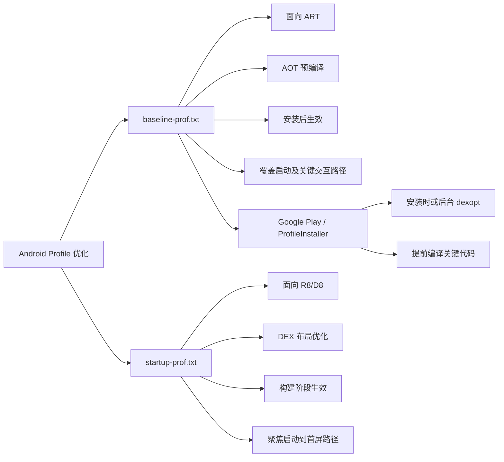

Android 应用启动和首轮交互的性能问题，本质上经常和“代码什么时候被编译、代码在 DEX 中放在哪里”有关。`baseline-prof.txt` 和 `startup-prof.txt` 都是为了解决这个问题而存在的 Profile 规则文件，但它们优化的阶段不同，目标也不同。

本文介绍这两个文件是什么、有什么用途，以及它们分别能解决什么问题。

## 1. 它们是什么

`baseline-prof.txt` 和 `startup-prof.txt` 都是人类可读的 ART Profile 规则文件。它们通常由 Baseline Profile Generator 测试生成，例如通过 `BaselineProfileRule.collect { ... }` 驱动应用执行关键路径，然后把运行过程中触达的类和方法记录下来。

典型规则长这样：

```text
Lcom/example/app/MainActivity;
HSPLcom/example/app/MainActivity;->onCreate(Landroid/os/Bundle;)V
```

其中：

- `L...;` 表示类描述符。
- `->method(...)` 表示方法规则。
- 前缀 `H`、`S`、`P` 是 profile flag，用于描述热度、启动、后启动等信息。

在项目中，源码态文件通常放在：

```text
app/src/main/baseline-prof.txt
app/src/main/baselineProfiles/startup-prof.txt
```

生成任务可能输出到：

```text
app/src/release/generated/baselineProfiles/baseline-prof.txt
app/src/release/generated/baselineProfiles/startup-prof.txt
```

构建 release 时，Android Gradle Plugin 会合并、重写、处理这些 profile。最终真正参与 release 的 profile 可能出现在类似路径：

```text
app/build/intermediates/combined_art_profile/release/compileReleaseArtProfile/baseline-prof.txt
app/build/intermediates/merged_startup_profile/release/mergeReleaseStartupProfile/startup-prof.txt
```

注意：源码里的 profile 规则不一定直接等于最终 APK 中的方法名。release 构建开启 R8 后，方法可能被混淆、内联、删除或合并。AGP/R8 会把 profile 规则重写成最终构建可用的形式。

## 2. baseline-prof.txt 是什么

`baseline-prof.txt` 是给 Android Runtime，也就是 ART，用来做 Profile Guided Optimization 的规则文件。

它描述的是：应用里哪些类和方法属于重要路径，应该更早被 ART 优化。

官方文档对 Baseline Profile 的定位是：ART 可以使用它对常用代码路径进行 Ahead-of-Time，也就是 AOT，预编译，从而让新安装或刚更新的用户在首次运行时就获得更好的性能，而不是等待设备运行一段时间后再靠 JIT 或后台 dexopt 慢慢优化。

构建 APK 或 AAB 时，AGP 会把人类可读的 `baseline-prof.txt` 编译成二进制 profile，并打包进应用中：

```text
assets/dexopt/baseline.prof
assets/dexopt/baseline.profm
```

设备安装或后续 profile 安装流程中，ART / ProfileInstaller / Google Play 可以消费这些二进制 profile，指导代码编译。

## 3. baseline-prof.txt 有什么用途

`baseline-prof.txt` 主要解决的是“代码还没有被优化”的问题。

没有 Baseline Profile 时，用户刚安装或刚更新应用，很多代码路径第一次执行时可能需要解释执行，或者在运行中触发 JIT 编译。这个过程会带来额外成本，表现为：

- 冷启动更慢。
- 页面首次打开更慢。
- 首次滚动更容易卡顿。
- 关键交互第一次执行时更抖。

Baseline Profile 的作用是提前告诉 ART：这些代码路径很重要，请优先优化。

适合放进 `baseline-prof.txt` 的路径包括：

- App 冷启动。
- 首页首屏。
- 登录、搜索、播放、评论等关键页面。
- Feed 滑动。
- 列表加载更多。
- 业务中高频、重性能敏感的用户路径。

所以 `baseline-prof.txt` 可以比较宽。它不只服务启动，也服务运行时关键交互。

一句话概括：

```text
baseline-prof.txt 影响的是“哪些代码更早被编译优化”。
```

## 4. startup-prof.txt 是什么

`startup-prof.txt` 是给构建工具使用的 Startup Profile。它和 Baseline Profile 格式相似，但作用阶段不同。

`startup-prof.txt` 不主要给设备上的 ART 做 AOT 编译，而是给 D8/R8 在 release 构建阶段使用。R8 会根据 Startup Profile 调整 DEX 布局，尽量把启动关键代码放进 primary dex，也就是 `classes.dex`。

Android 官方文档明确区分了二者：Startup Profile 用于 compile time 的 DEX layout optimization；Baseline Profile 用于 on-device optimization。

换句话说，Startup Profile 不是在设备上“再编译哪些方法”，而是在构建 APK/AAB 时决定“启动相关代码尽量排在哪里”。

一句话概括：

```text
startup-prof.txt 影响的是“启动关键代码在 DEX 文件中的位置”。
```

## 5. startup-prof.txt 有什么用途

Android 应用可能有多个 DEX 文件：

```text
classes.dex
classes2.dex
classes3.dex
...
```

启动时，如果启动关键代码分散在多个 DEX 文件中，系统需要访问更多 DEX 区域，代码局部性更差，启动路径上的加载成本也更高。

`startup-prof.txt` 的目标是改善启动代码的 DEX 布局，让启动路径上的类和方法尽量集中、靠前，尤其是进入 `classes.dex`。这样可以减少启动阶段的 DEX 加载和查找成本，提高冷启动表现。

适合放进 `startup-prof.txt` 的路径应该更窄，通常只包括：

- `Application.attachBaseContext`
- `Application.onCreate`
- 启动 Activity 的 `onCreate`
- Splash / 起始主题相关代码
- 首屏容器创建
- 首屏必要的依赖注入
- 初始显示必须执行的轻量路径

不适合放进 `startup-prof.txt` 的路径包括：

- 列表长距离滑动。
- 详情页跳转。
- 评论页、播放页等启动后交互。
- 加载更多。
- 非首屏业务流程。

这些路径应该进入 `baseline-prof.txt`，而不是 `startup-prof.txt`。

## 6. 二者核心区别

| 文件 | 使用者 | 生效阶段 | 主要目标 | 覆盖范围 |
| --- | --- | --- | --- | --- |
| `baseline-prof.txt` | ART / ProfileInstaller / Google Play | 安装后、后台 dexopt、手动 dexopt | 指导 AOT/JIT 优化关键代码路径 | 可以覆盖启动和启动后的关键用户路径 |
| `startup-prof.txt` | D8 / R8 | release 构建阶段 | 优化 DEX 布局，让启动代码更集中、更靠前 | 应只覆盖启动到初始显示必需的路径 |

更直接地说：

```text
baseline-prof.txt 解决“代码是否被提前编译优化”的问题。
startup-prof.txt 解决“启动代码是否被放在更适合启动加载的位置”的问题。
```

## 7. includeInStartupProfile 的意义

使用 `BaselineProfileRule.collect` 生成 profile 时，有一个关键参数：

```kotlin
rule.collect(
    packageName = "com.example.app",
    includeInStartupProfile = true
) {
    pressHome()
    startActivityAndWait()
}
```

`includeInStartupProfile = true` 的含义是：这段 critical user journey 不只进入 `baseline-prof.txt`，也会进入 `startup-prof.txt`。

因此它应该只用于“初始显示必需”的启动路径。

如果把列表滑动、详情页、评论页等路径也放在 `includeInStartupProfile = true` 的 block 中，`startup-prof.txt` 会变得过大。过大的 Startup Profile 可能让 R8 尝试把太多代码塞进 primary dex，反而挤占真正启动关键代码的位置。

更合理的拆分方式是：

```kotlin
@Test
fun startup() {
    rule.collect(
        packageName = "com.example.app",
        includeInStartupProfile = true
    ) {
        pressHome()
        startActivityAndWait()
    }
}

@Test
fun feedScroll() {
    rule.collect(
        packageName = "com.example.app",
        includeInStartupProfile = false
    ) {
        pressHome()
        startActivityAndWait()
        // wait for feed
        // scroll list
    }
}
```

这样：

- 启动路径进入 `startup-prof.txt` 和 `baseline-prof.txt`。
- 滑动路径只进入 `baseline-prof.txt`。

## 8. 它们如何解决性能问题

### 8.1 冷启动慢

冷启动慢通常涉及多个因素，例如进程创建、Application 初始化、Activity 初始化、布局创建、依赖注入、首屏数据加载等。

`baseline-prof.txt` 可以让启动路径上的热点代码更早被 ART 编译优化。

`startup-prof.txt` 可以让启动路径上的代码更集中地布局在 primary dex 中。

二者配合，既优化代码执行，也优化代码加载布局。

### 8.2 首次交互卡顿

列表首次滚动、页面首次打开、播放器首次初始化等路径，如果没有被提前优化，可能在第一次执行时触发解释执行或 JIT 编译。

这些路径适合放进 `baseline-prof.txt`，让用户第一次执行时就更顺滑。

### 8.3 等待 Cloud Profile 太慢

Google Play 的 Cloud Profile 依赖真实用户运行后聚合出来的数据。它有价值，但对新版本、新用户、非 Play 安装路径来说，不一定能在首次运行时立即生效。

Baseline Profile 是随应用版本一起发布的，能更早提供优化信号。

## 9. 如何验证是否生效

### 9.1 验证 baseline-prof.txt

可以检查 APK 中是否包含：

```text
assets/dexopt/baseline.prof
assets/dexopt/baseline.profm
```

也可以在设备上触发 ProfileInstaller 和 speed-profile 编译后检查：

```bash
adb shell am broadcast \
  -a androidx.profileinstaller.action.INSTALL_PROFILE \
  -n com.example.app/androidx.profileinstaller.ProfileInstallReceiver

adb shell cmd package compile \
  -m speed-profile -f --force-merge-profile com.example.app

adb shell cmd package art dump com.example.app
```

如果状态是：

```text
[status=speed-profile]
```

说明 profile-based dexopt 已经生效。

### 9.2 验证 startup-prof.txt

`startup-prof.txt` 不会像 `baseline.prof` 那样以独立文件在设备上直接验证。它的效果体现在构建产物的 DEX 布局里。

可以验证：

- AAB 中的 `r8.json` 是否标记了 startup dex。
- `startup-prof.txt` 中仍存在于 release 包中的启动类/方法，是否大多位于 `classes.dex`。
- 使用 Macrobenchmark 做 A/B 测试，对比带 Startup Profile 和不带 Startup Profile 的冷启动耗时。

结构验证只能说明布局应用了；真正收益仍然要看启动 benchmark。

## 10. 对本项目的实践建议

当前项目的启动 Activity 是：

```text
com.malin.video.home.HomeActivity
```

它在 `feature_home/src/main/AndroidManifest.xml` 中声明为 launcher activity。

如果把 Startup Profile 的范围定义为“HomeActivity 启动并完成同步 onCreate 链路”，那么 generator 中可以只保留：

```kotlin
pressHome()
startActivityAndWait()
```

如果把范围定义为“首页 feed 第一条内容已经可见”，那么等待 `home_rv_list` 或 `item_video_img` 会把 DataStore、ViewModel、网络请求、RecyclerView、Glide 等链路也纳入 `startup-prof.txt`。这并非一定错误，但会让 Startup Profile 明显变大。

推荐策略是：

- `startup-prof.txt`：只覆盖 HomeActivity 启动到初始显示必须路径。
- `baseline-prof.txt`：覆盖启动、首页 feed 首条内容、列表滑动、详情跳转等关键用户路径。

这样更符合二者的职责分工，也更容易避免 Startup Profile 过宽。

## 11. 总结

`baseline-prof.txt` 和 `startup-prof.txt` 都是 Android 性能优化链路中的 profile 文件，但不要把它们看成同一个东西。

`baseline-prof.txt` 面向 ART，解决代码提前编译优化问题，适合覆盖更广的关键用户路径。

`startup-prof.txt` 面向 R8/D8，解决启动代码 DEX 布局问题，应该聚焦启动到初始显示。

实际项目中，最常见的问题是把启动后交互也放进 `includeInStartupProfile = true`，导致 `startup-prof.txt` 和 `baseline-prof.txt` 高度相似。正确做法是把启动和启动后关键路径拆开采集，让两个文件各司其职。

参考资料：

- Android Developers: Baseline Profiles overview  
  https://developer.android.com/baseline-profiles
- Android Developers: Difference between Baseline Profiles and Startup Profiles  
  https://developer.android.com/topic/performance/baselineprofiles/difference-baseline-startup
- Android Developers: Overview of Startup Profiles  
  https://developer.android.com/topic/performance/startupprofiles/overview
- Android Developers: Create Baseline Profiles  
  https://developer.android.com/topic/performance/baselineprofiles/create-baselineprofile
- Android Developers: Create Startup Profiles / DEX layout optimizations  
  https://developer.android.com/topic/performance/startupprofiles/dex-layout-optimizations

## 12. Google Play、baseline-prof.txt 和 ProfileInstaller 如何协作

理解 Baseline Profile 时，还需要把 Google Play 和 ProfileInstaller 放进同一条链路里看。

三者分工可以这样概括：

```text
baseline-prof.txt 是优化清单
Google Play 是分发/安装通道
ProfileInstaller 是非 Play 或运行后补救通道
```

### 12.1 baseline-prof.txt：告诉系统哪些代码重要

`baseline-prof.txt` 是开发者随 App 发布的性能规则文件，里面记录启动、首页、关键交互等路径涉及的类和方法。

构建 release 时，AGP 会把它编译成 APK/AAB 里的二进制 profile：

```text
assets/dexopt/baseline.prof
assets/dexopt/baseline.profm
```

设备上的 ART 可以使用这些 profile 做 `speed-profile` 编译，让关键代码提前 AOT 优化。

### 12.2 Google Play：安装时使用 Baseline Profile

如果用户通过 Google Play 安装 App，Google Play / Package Manager 可以在安装阶段识别并使用 APK/AAB 中的 Baseline Profile。

结果是：用户第一次打开 App 前，系统就可能已经基于 profile 做了部分编译优化。这样冷启动、首轮页面打开、首次滚动等路径会更快。

Play 安装路径下的链路大致是：

```text
APK/AAB 内置 baseline.prof
        ↓
Google Play / Package Manager 安装
        ↓
ART 使用 profile 做 dexopt
        ↓
App 首次运行时关键代码已经更接近优化状态
```

这是最理想的路径，因为优化可以在用户首次打开 App 前尽早发生。

### 12.3 ProfileInstaller：把内置 profile 写入设备

`ProfileInstaller` 是 Jetpack 库，作用是把 APK 里内置的 baseline profile 安装到设备本地 profile 位置。

它主要补足这些场景：

- 通过 `adb install` 安装。
- 通过第三方应用商店安装。
- 设备或安装路径没有在安装阶段消费 Baseline Profile。
- 开发、测试、手动验证 profile 效果。

ProfileInstaller 的运行链路大致是：

```text
App 启动
   ↓
ProfileInstaller 读取 APK 中 assets/dexopt/baseline.prof
   ↓
写入设备本地 profile
   ↓
系统后续后台 dexopt 或手动 cmd package compile 使用它
```

手动验证时常见命令：

```bash
adb shell am broadcast \
  -a androidx.profileinstaller.action.INSTALL_PROFILE \
  -n com.example.app/androidx.profileinstaller.ProfileInstallReceiver

adb shell cmd package compile \
  -m speed-profile -f --force-merge-profile com.example.app
```

### 12.4 三者完整协作流程

从开发到设备运行，完整流程可以表示为：

```text
开发阶段:
BaselineProfileGenerator
    ↓
生成 baseline-prof.txt

构建阶段:
AGP/R8
    ↓
把 baseline-prof.txt 编译进 APK/AAB:
assets/dexopt/baseline.prof
assets/dexopt/baseline.profm

Google Play 安装路径:
Google Play / Package Manager
    ↓
安装时消费 baseline profile
    ↓
ART 预编译关键代码

非 Play / adb / 第三方安装路径:
App 首次运行或手动触发 ProfileInstaller
    ↓
ProfileInstaller 写入内置 profile
    ↓
后台 dexopt 或手动 speed-profile 编译
    ↓
ART 预编译关键代码
```

一句话总结：

`baseline-prof.txt` 是你提供的优化意图；Google Play 会在理想安装路径上尽早把它交给 ART 使用；ProfileInstaller 则保证在 Play 之外的安装路径中，App 仍有机会把内置 profile 写入设备，让 ART 后续使用它优化代码。

## 13. 非 Google Play 渠道下，后台 dexopt 什么时候触发

如果用户是从非 Google Play 渠道下载 App，并且 APK 中已经包含 `baseline-prof.txt` 和 `ProfileInstaller`，通常不会在安装完成的那一刻就立刻完成 AOT 编译。更准确的流程是：`ProfileInstaller` 先把 APK 内置的 baseline profile 写入设备本地 profile，然后等待系统后续的后台 dexopt 任务，或者通过命令手动触发 `speed-profile` 编译。

### 13.1 必要条件

后台 dexopt 想要真正利用内置 baseline profile，通常需要满足这些条件：

- App 至少启动过一次，让 `ProfileInstallerInitializer` 有机会运行。
- `ProfileInstaller` 成功读取 APK 中的 `assets/dexopt/baseline.prof` 和 `assets/dexopt/baseline.profm`。
- `ProfileInstaller` 成功把 profile 写入设备本地 profile 位置。
- 系统后续调度后台 dexopt 任务。
- 设备状态满足系统执行后台优化的条件，例如空闲、充电、温度和存储状态允许。

也就是说，非 Play 渠道的关键差异是：profile 写入和 dexopt 编译通常不是安装时同步完成，而是分成了两个阶段。

```text
第三方渠道安装 APK
        ↓
用户首次启动 App
        ↓
ProfileInstaller 写入 baseline profile
        ↓
系统后台 dexopt 任务在合适时机运行
        ↓
ART 使用 profile 做 speed-profile 编译
```

### 13.2 ProfileInstaller 的职责边界

`ProfileInstaller` 负责“安装 profile”，不负责保证系统马上 AOT 编译。

它能做的是：

- 从 APK 中读取内置 baseline profile。
- 把 profile 写入设备的 app profile 位置。
- 让系统后续 dexopt 有 profile 可以使用。

它不能保证的是：

- 安装 APK 后立即完成编译。
- App 首次启动前就已经完成编译。
- 所有 ROM 都在完全相同的时间触发后台 dexopt。

因此，非 Play 渠道下更合理的预期是：首次启动时 `ProfileInstaller` 写入 profile，之后系统在后台优化窗口中完成 `speed-profile` 编译。第二次或后续启动更可能吃到 AOT 优化收益。

### 13.3 后台 dexopt 的触发时机

Android 系统会周期性运行后台 dexopt job。AOSP ART Service 文档中描述，默认后台 dexopt job 通常每天调度一次，并在设备空闲、充电等条件满足时运行。如果设备不再空闲，任务可能被取消或延后。

实际触发时间还会受到这些因素影响：

- Android 版本。
- 厂商 ROM 对后台任务和电量策略的修改。
- 电池状态。
- 设备温度。
- 存储空间。
- 用户是否频繁使用设备。
- App 是否刚写入了新的 profile。

所以，线上用户从第三方渠道安装后，不能假设“安装后马上 speed-profile”。更稳妥的说法是：`ProfileInstaller` 让 App 在非 Play 渠道也具备被后台 dexopt 优化的条件。

### 13.4 如何判断是否已经进入可编译状态

App 内可以通过 `ProfileVerifier` 判断 profile 状态。比较关键的状态是：

```text
RESULT_CODE_PROFILE_ENQUEUED_FOR_COMPILATION
```

它表示 profile 已经安装，并且等待后续编译。这个状态不等于已经完成 AOT 编译，但说明 `ProfileInstaller` 这一阶段基本完成，后面要等系统 dexopt。

设备侧可以通过 ART dump 查看当前包的编译状态：

```bash
adb shell cmd package art dump com.malin.video
```

如果看到类似状态：

```text
status=speed-profile
reason=bg-dexopt
```

通常说明系统后台 dexopt 已经基于 profile 完成过编译。

### 13.5 如何手动模拟非 Play 渠道优化流程

测试时可以手动触发 `ProfileInstaller` 写入 profile：

```bash
adb shell am broadcast \
  -a androidx.profileinstaller.action.INSTALL_PROFILE \
  -n com.malin.video/androidx.profileinstaller.ProfileInstallReceiver
```

然后手动触发基于 profile 的编译：

```bash
adb shell cmd package compile \
  -m speed-profile -f --force-merge-profile com.malin.video
```

最后检查编译状态：

```bash
adb shell cmd package art dump com.malin.video
```

这个流程适合本地验证 `baseline-prof.txt`、`ProfileInstaller` 和 ART dexopt 是否能够串起来。但它比真实用户路径更主动，因为真实用户通常要等系统后台 dexopt job 自动调度。

一句话总结：

非 Google Play 渠道下，`ProfileInstaller` 负责把内置 `baseline-prof.txt` 写入设备；真正的 AOT 编译由系统后台 dexopt 在设备空闲、充电等合适条件下触发。ProfileInstaller 让优化“有条件发生”，但不保证安装后立即完成编译。

## 14. 思维导图


