面对 AI 编程对软件开发带来的巨大冲击，世界最具影响力的软件架构与工程思想家之一 Robert C. Martin（Uncle Bob）是如何思考的？当代码可以由 AI 高速生成，测试、架构、工程原则以及程序员自身的价值又将发生怎样的变化？本文通过他的原帖与实践，呈现他对这些问题的回答。

> 检索截止日期：2026-08-02；各节标注的发布日期均为 UTC 时间。
>
> 以下内容是对 Uncle Bob（Robert C. Martin）英文原帖的完整中文翻译，并非其本人发布的中文版本。文中的“AI 智能体”对应原文 `AI agents`；为体现语义差异，`programming` 主要译为“程序设计”，`coding` 主要译为“亲手写代码”。
>
> 除第 3 节外，每节均收录对应帖子的完整英文原文，可通过节内的 X 链接逐字核对；第 3 节的帖子正文只有一句话，其英文内容为所附视频的转录，并非帖子文本。若原帖是对他人的回复，节内会附上被回复者的原话，以保留语境。

## 一、原帖完整翻译

### 1. 不审查 AI 写出的代码，而是设置严密的验证关卡

- 发布日期：2026-07-23（UTC）
- [查看 X 原帖](https://x.com/unclebobmartin/status/2080257779395154409)
- 对话背景：这是对 [@ori_pomerantz](https://x.com/ori_pomerantz/status/2080024439345828249) 的回复。对方写道：「我正尝试用 Claude 帮我写点东西，但就是不放心让它直接编辑我的文件。还有人有同感吗？如果我要为代码负责，我**必须**理解它——哪怕只是出于心理上的原因。我从 1983 年开始编程。算老吗？」

#### 英文原文

> I’m significantly older than you. I started coding in the late 60s. My current strategy is to not read any of the code written by my agents. That’s the only way I can take advantage of their productivity. What I do instead is to surround the agents with extreme constraints. Unit tests, gherkin tests, QA procedures, quality metrics, mutation testing, test coverage, and a plethora of others. In the end, I have very high confidence in the code they produce because they’ve had to run the gauntlet of all of my constraints and tests.

#### 完整中文翻译

> 我的年龄比你大得多。我从 20 世纪 60 年代末就开始写代码了。我目前采用的策略，是不阅读我的 AI 智能体写出的任何代码。这是我能够利用它们生产力的唯一方式。
>
> 我采取的替代办法，是用极其严格的约束包围这些智能体：单元测试、Gherkin 测试、QA 流程、质量指标、变异测试、测试覆盖率，以及许许多多其他措施。
>
> 最终，我对它们产出的代码拥有很高的信心，因为这些代码必须闯过我设置的全部约束和测试关卡。

#### 思维导图

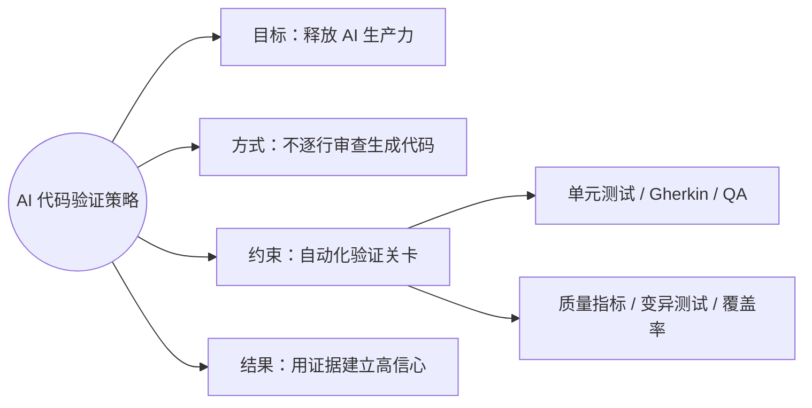

### 2. 将 AI 节省的时间用于扩大验证

- 发布日期：2026-07-26（UTC）
- [查看 X 原帖](https://x.com/unclebobmartin/status/2081332683582427641)

#### 英文原文

> AI agents can write code many times faster than a human. What this means is that you, the programmer, have a large amount of time to use those agents to write unit tests, to write acceptance, tests, to write property tests, to torture test, to mutate test, to QA test, and to otherwise ensure that the code meets its functional and quality requirements. And even after spending all that time, you will still be many times more productive than a human programmer, and the result will be better.

#### 完整中文翻译

> AI 智能体写代码的速度可以比人类快很多倍。这意味着，作为程序员，你将拥有大量时间，可以让这些智能体编写单元测试、验收测试、属性测试，进行极限压力测试、变异测试和 QA 测试，并通过其他方式确保代码满足功能需求和质量要求。
>
> 即使把所有这些时间都投入进去，你的生产力仍会比人类程序员高出许多倍，而且最终结果会更好。

#### 思维导图

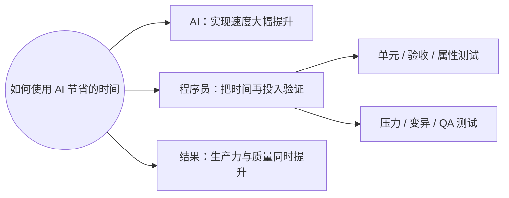

### 3. “20 倍效率”视频发言

- 发布日期：2026-07-26（UTC）
- [查看 X 视频原帖](https://x.com/unclebobmartin/status/2081334541667410312)
- 说明：该帖正文只有一句话 ——「Morning bathrobe rant: 20X.」，主要内容在所附视频中。下方英文为该视频的转录而非帖子文本，转录可能存在误差，建议以视频为准。

#### 视频转录（英文）

> AI agents can write code many times faster than you can. Maybe 20 times. What are you going to do with all that extra time they give you? You're going to have those agents with their 20 times power write unit tests and acceptance tests and QA tests, and then you're going to mutate those tests, and you're going to run quality metrics, and you are going to torture the code. You'll write property tests, you'll write performance tests. If there's multithreaded code, you will write jitter tests, and you will have the agents do that because they're 20 times faster than you are. And when you're done with all of that, you will have code that is better than you could ever have produced, and you will have gotten it in far less time than a human could possibly do.

#### 完整中文翻译

> AI 智能体写代码的速度可以比你快很多倍，也许能快 20 倍。你准备怎样利用它们为你带来的这些额外时间？
>
> 你会让这些拥有 20 倍能力的智能体编写单元测试、验收测试和 QA 测试；然后对这些测试进行变异，执行质量度量，并对代码进行严酷测试。你还会编写属性测试和性能测试。如果涉及多线程代码，你会编写抖动测试（jitter tests），并让智能体完成这些工作，因为它们的速度是你的 20 倍。
>
> 当你完成这一切后，得到的代码将比你自己所能产出的任何代码都更好，而且取得这些代码所花的时间，将远少于人类完成同样工作可能需要的时间。

#### 思维导图

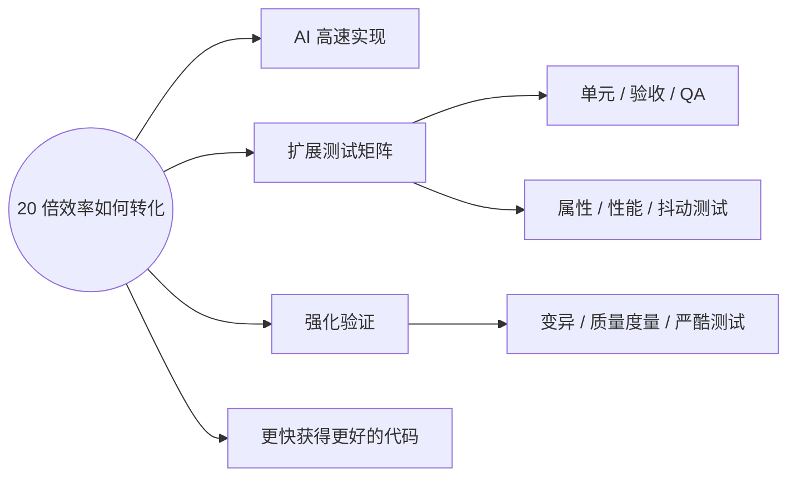

### 4. 能够堆叠测试，不代表总应该这样做

- 发布日期：2026-07-02（UTC）
- [查看 X 原帖](https://x.com/unclebobmartin/status/2072736888478175413)

#### 英文原文

> I’ve been pushing very hard on overloading with tests. Gherkin test unit test QA test mutation test gherkin mutation test. It’s easy to make the AI’s do these things. But just because we can do them doesn’t mean we actually should.
>
> Lots of times I just use unit tests and crap evaluation. That seems to work pretty well. For larger projects I can imagine that gherkin testing is pretty useful and so is QA testing. I’m checking that now.

#### 完整中文翻译

> 我一直在非常积极地尝试给项目叠加大量测试：Gherkin 测试、单元测试、QA 测试、变异测试，以及 Gherkin 变异测试。让 AI 做这些事情很容易。但仅仅因为我们能够这样做，并不意味着我们实际上总应该这样做。
>
> 很多时候，我只使用单元测试和 CRAP 指标评估，看起来效果相当不错。对于更大的项目，我认为 Gherkin 测试会很有用，QA 测试也是如此。我目前正在验证这一点。

#### 思维导图

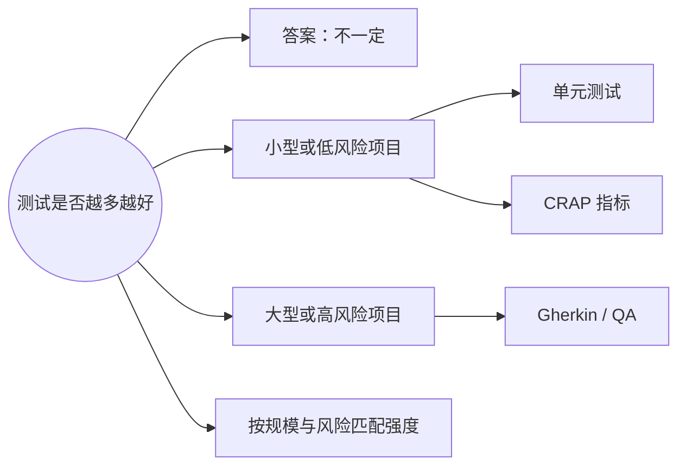

### 5. TDD 原则仍然有效，但技术需要适应 AI

- 发布日期：2026-02-15（UTC）
- [查看 X 原帖](https://x.com/unclebobmartin/status/2023158252700066287)

#### 英文原文

> TDD is very inefficient for AIs. Testing is essential for them but not in the micro steps that the three laws of TDD recommend.
>
> Principles remain the same but techniques must be adjusted to fit the different “mind” of the AI.
>
> Think of the AI as a highly focused idiot savant with a big short term memory and yet horribly absent minded.

#### 完整中文翻译

> TDD 对 AI 来说效率非常低。测试对 AI 至关重要，但不应该采用 TDD 三定律所推荐的那种微小步骤。
>
> 原则保持不变，但技术必须调整，以适应 AI 那种不同的“思维”。
>
> 可以把 AI 想象成一个高度专注的“白痴天才”：拥有庞大的短期记忆，却又健忘得可怕。

#### 思维导图

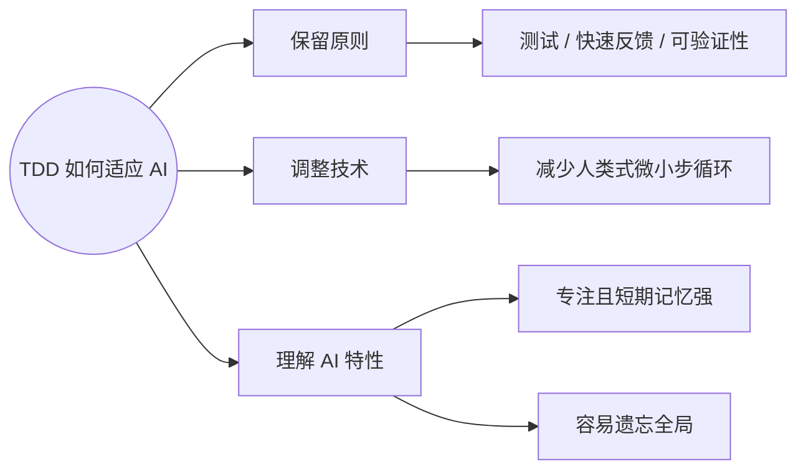

### 6. AI 时代需要更强的工程原则

- 发布日期：2026-03-12（UTC）
- [查看 X 原帖](https://x.com/unclebobmartin/status/2032143554953241008)

#### 英文原文

> In the first decades of computer programming, there were no engineering principles. We just threw code at the machines and kept what worked.
>
> It has taken us 80 years to build up a minimal set of engineering principles -- and few yet follow and understand them.
>
> AI vastly increases the power of a programmer. That minimal set will have to be expanded. And those who don't use the minimal set will have to learn.

#### 完整中文翻译

> 在计算机编程最初的几十年里，并不存在什么工程原则。我们只是不断把代码扔给机器，然后留下那些能够运行的东西。
>
> 我们花了 80 年才建立起一套最基本的工程原则，而直到现在，真正遵循并理解这些原则的人仍然很少。
>
> AI 极大地增强了程序员的能力。这套最基本的原则将不得不继续扩展；而那些尚未采用这些基本原则的人，也必须开始学习它们。

#### 思维导图

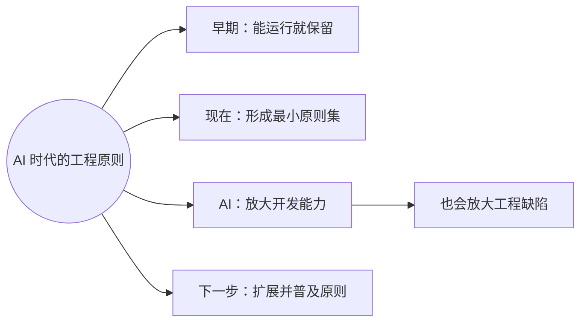

### 7. Claude 擅长局部细节，但缺少全局和架构能力

- 发布日期：2026-01-22（UTC）
- [查看 X 原帖](https://x.com/unclebobmartin/status/2014311028972994582)

#### 英文原文

> Claude codes faster than I do, by a significant factor. Claude can hold more details in its "mind" than I can -- again by a significant factor.
>
> But Claude cannot hold the big picture in it's mind. It doesn't really even understand the concept of a big picture. Architecture is likely beyond it's capacity.
>
> And although Claude appreciates the value of refactoring, it shows no inclination to acquire that value for itself. It has no sense of self preservation. It does not look ahead and foresee the disaster it is creating.

#### 完整中文翻译

> Claude 写代码的速度比我快，而且快得相当明显。Claude 能够在它的“脑中”同时保留比我更多的细节，这一点的差距同样相当明显。
>
> 但是 Claude 无法在脑中把握全局。它甚至并不真正理解“全局”这个概念。架构很可能超出了它的能力范围。
>
> 尽管 Claude 能够理解重构的价值，但它并没有表现出主动把这种价值变成自身行为的倾向。它没有自我保护意识，也不会向前看，更无法预见自己正在制造的灾难。

#### 思维导图

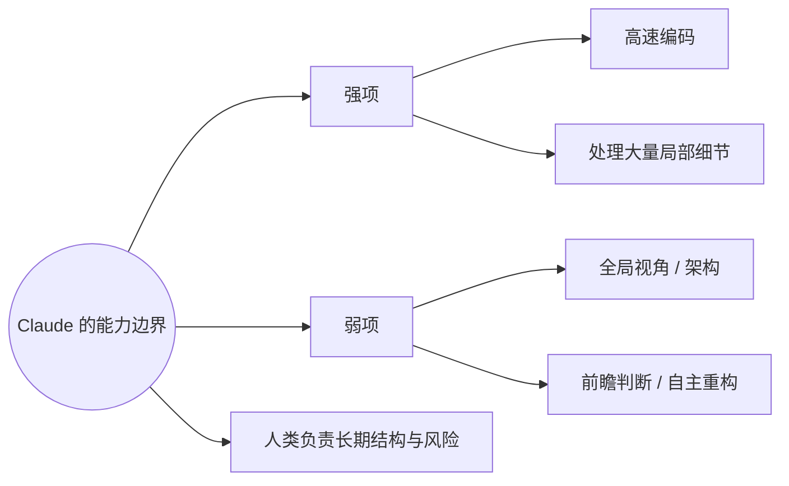

### 8. 程序员的核心能力不只是写代码

- 发布日期：2026-02-11（UTC）
- [查看 X 原帖](https://x.com/unclebobmartin/status/2021605465352806511)
- 对话背景：这是对 [@OdiiAriwodo\_](https://x.com/OdiiAriwodo_/status/2021598285559959677) 的回复。对方提问：「可以确认，AI 就是写代码的新方式。那么问题来了：软件工程师新的技能集究竟是什么？AI 仍然在产出代码，但你还需要懂编程语言，才能让它写出正确的代码吗？」

#### 英文原文

> For the time being AI coders will need a good working knowledge of code in order to be most effective; but that need is going to recede as the models improve. But code is the least of the skills that a good programmer needs. Problem solving, system thinking, product awareness, and structural competence have always been more important than coding; and those skills are more important than ever.

#### 完整中文翻译

> 就目前而言，要想最有效地使用 AI 编程工具，使用者仍需具备良好的代码知识；但随着模型不断改进，这种需要将逐渐减弱。
>
> 然而，在一名优秀程序员所需要的全部能力中，代码本身是最次要的。解决问题、系统思维、产品意识和结构能力，一直都比亲手写代码更重要；而现在，这些能力比以往任何时候都更加重要。

#### 思维导图

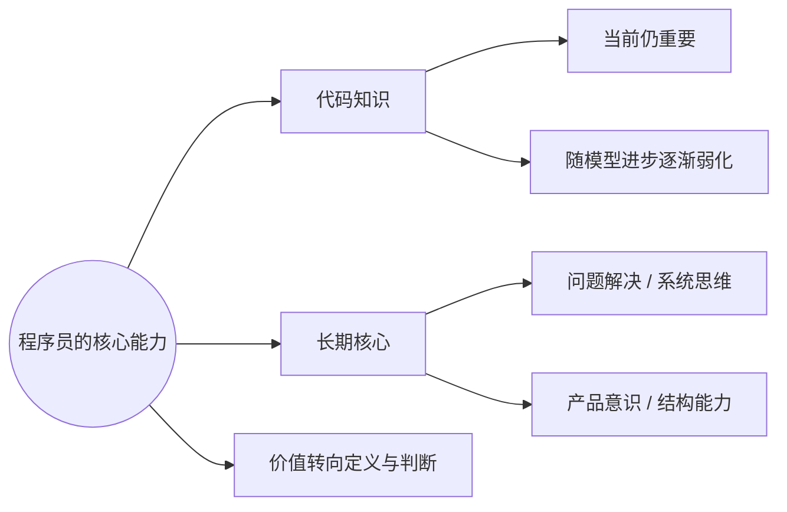

### 9. 仍然在做程序设计，只是不再亲手写代码

- 发布日期：2026-02-26（UTC）
- [查看 X 原帖](https://x.com/unclebobmartin/status/2027079037957349380)

#### 英文原文

> I do not feel like I'm not programming. In fact, I feel like I am programming more intensely than ever. I'm just not coding.

#### 完整中文翻译

> 我并不觉得自己已经不再做程序设计。事实上，我觉得自己正以前所未有的强度进行程序设计。我只是不再亲手写代码而已。

#### 思维导图

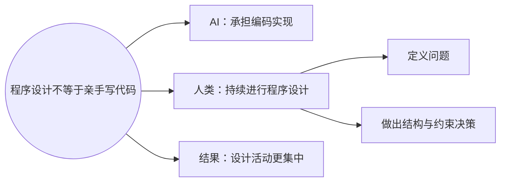

### 10. Claude 帮助定位性能瓶颈的实践案例

- 发布日期：2026-01-13（UTC）
- [查看 X 原帖](https://x.com/unclebobmartin/status/2011113547757990257)

#### 英文原文

> Claude just helped me drastically reduce rendering overhead by instrumenting the code with some metrics and then asking me to report those metrics back to it. It used that to determine the bottleneck and decreased my rendering overhead by 90%. Yikes!

#### 完整中文翻译

> Claude 刚刚帮我大幅降低了渲染开销。它先在代码中加入了一些度量指标，然后让我把这些指标的结果反馈给它。它利用这些数据确定了瓶颈，并把我的渲染开销降低了 90%。我的天！

#### 思维导图

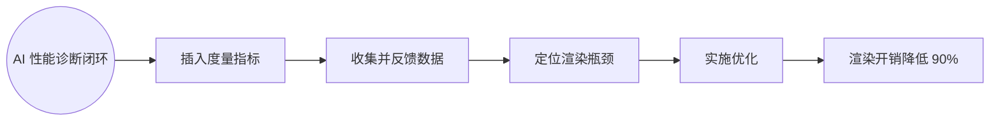

### 11. 这是工程，不是凭感觉编程

- 发布日期：2026-07-28（UTC）
- [查看 X 原帖](https://x.com/unclebobmartin/status/2082060037183209786)
- 对话背景：这是对 Minecraft 作者 Markus「notch」Persson（[@notch](https://x.com/notch/status/2081917722854674642)）的回复。对方写道：「天哪，一切就是这样开始的吗？我已经在给自己找使用场景了，比如把我所有的 TypeScript 转成 JavaScript。来吧 Claude，看看你有什么本事！如果我自己也变成了 vibe coder，我还能继续嘲笑 vibe coder 吗？」

#### 英文原文

> @notch It’s engineering, not vibing.

#### 完整中文翻译

> @notch 这是工程，不是凭感觉编程（vibing）。

#### 思维导图

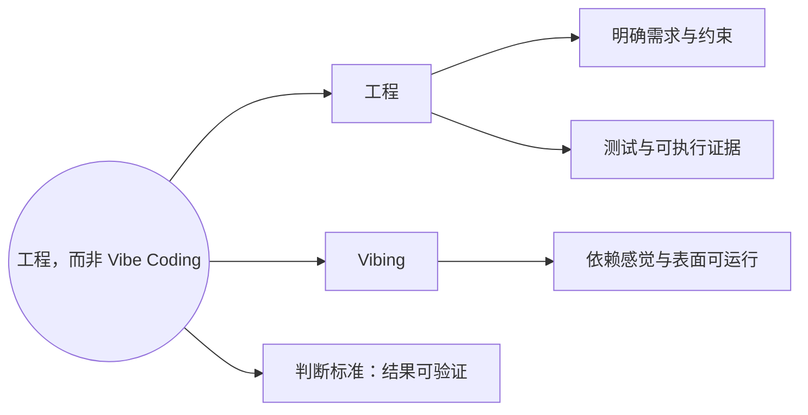

## 二、核心观点汇总

### 1. 他拥抱 AI 编程，但反对无约束的 Vibe Coding

Uncle Bob 并不排斥 AI 编程。他已经把 AI 智能体用于代码实现、性能诊断和测试生成。但他认为，AI 的高产出必须被工程约束包围，不能仅凭结果“看起来能运行”就交付。

### 2. “不阅读 AI 代码”有严格前提

他所说的不阅读智能体代码，并不等于盲目信任。其前提是用单元测试、验收测试、QA 流程、覆盖率、质量指标、变异测试等多层可执行证据建立信心。本质上，这是把部分逐行代码审查转化为系统化、自动化的验证关卡。

### 3. AI 节省的时间应重新投入质量保障

AI 将实现速度提升数倍甚至更多后，程序员不应只追求产出更多功能，而应利用节省的时间扩大测试范围、压力验证、性能验证和 QA。这样才能同时获得更高生产力和更高质量。

### 4. 测试强度应与项目风险相匹配

他也明确承认，并非每个项目都需要完整的测试矩阵。较小或风险较低的项目可能只需要单元测试和质量指标；规模更大、风险更高的系统则需要更完整的验收测试与 QA。这仍是他正在实践和验证的方法，而不是已经确定的通用公式。

### 5. TDD 的原则保留，执行方式需要改变

测试、快速反馈和可验证性仍然重要，但面向人类程序员设计的 TDD 微小步循环，不一定适合高速工作的 AI 智能体。AI 时代需要保留工程原则，同时重新设计具体技术和反馈粒度。

### 6. AI 强于局部实现，人类仍需掌握全局

AI 能快速处理大量局部细节，却缺少稳定的系统全局观、长期判断和主动维护结构的动机。因此，架构设计、边界划分、风险判断、产品目标和长期可维护性仍主要由人类负责。

### 7. 程序员的价值正在从“写代码”转向“定义正确性”

问题解决、系统思维、产品意识、结构能力，以及把需求转换成可验证约束的能力，将比亲手输入代码更重要。AI 可以承担越来越多的实现工作，但人类仍需决定要解决什么问题、系统应具有什么结构，以及怎样证明结果正确。

### 8. AI 放大能力，也会放大工程缺陷

AI 提高了程序员的产出能力，同时也可能更快地制造结构混乱和潜在灾难。因此，AI 时代不是减少工程原则，而是需要扩展并更严格地落实这些原则。

## 三、一句话总结

Uncle Bob 的立场可以概括为：**让 AI 高速生产代码，让人类负责需求、架构和约束，再用与风险相匹配的自动化验证证明结果正确——这是工程，不是凭感觉编程。**
